# 🤖 PHẦN 1: AUTOMATION TESTING FUNDAMENTALS

> **Mục tiêu**: Hiểu rõ Automation Testing là gì, khi nào nên automate, và nền tảng để bắt đầu học Selenium.

---

## 📑 MỤC LỤC

1. [Automation Testing là gì?](#automation-testing-là-gì)
2. [Manual vs Automation Testing](#manual-vs-automation-testing)
3. [Khi nào nên Automate?](#khi-nào-nên-automate)
4. [ROI Calculation](#roi-calculation)
5. [Test Automation Pyramid](#test-automation-pyramid)
6. [Selenium Ecosystem](#selenium-ecosystem)
7. [Challenges trong Automation](#challenges-trong-automation)

---

## 🎯 Automation Testing là gì?

> **Automation Testing** = Sử dụng **tools và scripts** để tự động thực thi test cases thay vì làm thủ công (manual).

### Định nghĩa đơn giản

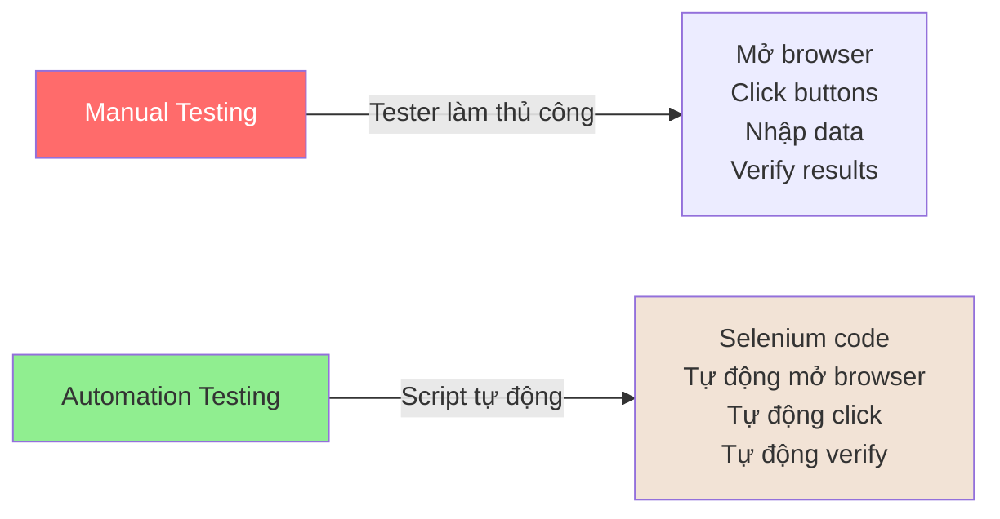

---

### Ví dụ cụ thể

#### Scenario: Test Login Function

**Manual Testing** (tester làm):
```
Bước 1: Mở Chrome browser
Bước 2: Vào https://demo.opencart.com
Bước 3: Click "My Account" → "Login"
Bước 4: Nhập Email: test@example.com
Bước 5: Nhập Password: Test@123
Bước 6: Click "Login" button
Bước 7: Verify: Dashboard hiển thị đúng
Bước 8: Verify: Welcome message xuất hiện

⏱️ Thời gian: ~2-3 phút/lần
🔁 Mỗi lần regression test phải làm lại
😫 Nhàm chán khi làm 100 lần
```

**Automation Testing** (script tự động):
```java
@Test
public void testLogin() {
    // Bước 1-3: Tự động
    driver.get("https://demo.opencart.com");
    driver.findElement(By.linkText("My Account")).click();
    driver.findElement(By.linkText("Login")).click();
    
    // Bước 4-6: Tự động
    driver.findElement(By.id("input-email"))
          .sendKeys("test@example.com");
    driver.findElement(By.id("input-password"))
          .sendKeys("Test@123");
    driver.findElement(By.cssSelector("input[type='submit']"))
          .click();
    
    // Bước 7-8: Tự động verify
    Assert.assertTrue(
        driver.findElement(By.id("content")).isDisplayed()
    );
}

⏱️ Thời gian: ~5-10 giây/lần
🔁 Chạy tự động bao nhiêu lần cũng được
😊 Máy chạy, tester làm việc khác
```

---

### Lợi ích của Automation

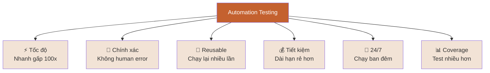

---

## 🆚 Manual vs Automation Testing

### So sánh chi tiết

| Tiêu chí | Manual Testing | Automation Testing |
|----------|----------------|-------------------|
| **⚡ Tốc độ** | Chậm (human speed) | Nhanh gấp 100x (computer speed) |
| **💵 Chi phí ban đầu** | Thấp (chỉ cần tester) | Cao (viết scripts, training) |
| **💰 Chi phí dài hạn** | Cao (lương nhân sự mãi) | Thấp (scripts chạy free) |
| **🎯 Độ chính xác** | Dễ sai (human error) | 100% chính xác |
| **🔄 Test lặp lại** | Nhàm chán, mất thời gian | Hoàn hảo cho regression |
| **🧠 Exploratory Testing** | ✅ Tốt (cần creativity) | ❌ Không thể (máy không sáng tạo) |
| **👁️ Usability Testing** | ✅ Tốt (cần human eyes) | ❌ Khó (cần tools đặc biệt) |
| **⏰ Thời gian làm việc** | 8 giờ/ngày | 24/7 (chạy ban đêm) |
| **🌐 Cross-browser** | Tốn thời gian | Dễ (parallel execution) |
| **🔧 Maintenance** | Không cần | Cần update khi UI thay đổi |

---

### Khi nào dùng cái gì?

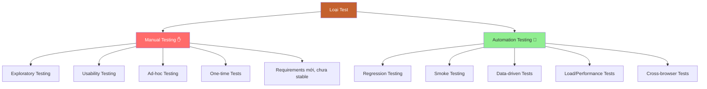

> 💡 **Best Practice**: Kết hợp cả Manual + Automation để đạt hiệu quả tốt nhất!

---

## ✅ Khi nào nên Automate?

### NÊN Automate ✅

#### 1. Regression Testing

**Lý do**: Test cases chạy lại nhiều lần mỗi release

```
Ví dụ: E-commerce website
- Login test: Chạy mỗi release (2 lần/tuần)
- Add to cart: Chạy mỗi release
- Checkout: Chạy mỗi release

→ 1 năm = 100+ lần chạy
→ Manual = lãng phí thời gian
→ Automation = Perfect fit!
```

---

#### 2. Smoke Testing

**Lý do**: Test nhanh các chức năng chính sau mỗi build

```
Smoke Tests:
✅ App launch được không?
✅ Login hoạt động không?
✅ Homepage load không?
✅ Core features available không?

Chạy sau: Mỗi build mới (5-10 lần/ngày)
→ Automation tiết kiệm rất nhiều thời gian!
```

---

#### 3. Data-Driven Testing

**Lý do**: Cùng test case với nhiều data sets

```
Test Login với 100 users khác nhau:
- User1: test1@example.com / Pass1
- User2: test2@example.com / Pass2
- ...
- User100: test100@example.com / Pass100

Manual: 100 lần × 2 phút = 200 phút (3+ giờ)
Automation: Chạy vòng lặp, 5 phút xong!
```

---

#### 4. Cross-Browser Testing

**Lý do**: Test trên nhiều browsers (Chrome, Firefox, Safari, Edge)

```
Manual: 
- Test trên Chrome: 1 giờ
- Test trên Firefox: 1 giờ
- Test trên Safari: 1 giờ
- Test trên Edge: 1 giờ
Total: 4 giờ

Automation:
- Chạy parallel trên 4 browsers: 1 giờ
Total: 1 giờ (tiết kiệm 75%!)
```

---

#### 5. Performance/Load Testing

**Lý do**: Simulate 1000+ concurrent users

```
Manual: Không thể!
Automation: JMeter, LoadRunner
→ Simulate 10,000 users cùng lúc
```

---

### KHÔNG NÊN Automate ❌

#### 1. One-time Tests

```
Ví dụ: Test tính năng demo cho 1 client
- Chỉ chạy 1 lần rồi bỏ
- Viết automation mất 2 giờ
- Chạy manual mất 30 phút

→ Lãng phí thời gian viết automation!
```

---

#### 2. Exploratory Testing

```
Cần human creativity:
- "Nếu tôi làm thế này thì sao?"
- "Nếu tôi nhập emoji vào email field?"
- "Nếu tôi click 100 lần liên tục?"

→ Máy không nghĩ ra các scenarios này
→ Cần human tester!
```

---

#### 3. Usability Testing

```
Câu hỏi cần trả lời:
- UI có đẹp không?
- Button có dễ tìm không?
- Error message có clear không?
- Navigation có intuitive không?

→ Cần human judgment
→ Automation không thể đánh giá
```

---

#### 4. Requirements thay đổi liên tục

```
Scenario:
Tuần 1: Viết automation cho feature A
Tuần 2: Requirements đổi, feature A bỏ
Tuần 3: Viết lại automation cho feature A v2
Tuần 4: Requirements lại đổi...

→ Lãng phí thời gian maintain automation
→ Chờ requirements stable rồi mới automate!
```

---

### Decision Tree

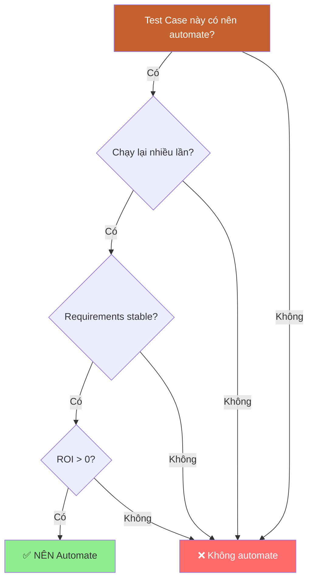

---

## 💰 ROI Calculation

> **ROI** (Return on Investment) = Tính toán xem automation có đáng đầu tư không?

### Công thức

```
ROI = (Lợi ích - Chi phí) / Chi phí × 100%

Chi phí:
- Thời gian viết automation scripts
- Tool licenses (nếu có)
- Training team
- Maintenance cost

Lợi ích:
- Thời gian tiết kiệm (không phải manual)
- Phát hiện bugs sớm hơn
- Chạy tests 24/7
- Giảm human errors
```

---

### Ví dụ thực tế

**Scenario**: E-commerce website, 200 test cases cho regression testing

#### Manual Testing Cost

```
Thông tin:
- 200 test cases
- Mỗi test case: 5 phút
- Tổng thời gian: 200 × 5 = 1000 phút = 16.7 giờ

Tần suất:
- 2 releases/tháng
- → 2 × 16.7 = 33.4 giờ/tháng

Chi phí:
- Lương tester: 15 triệu/tháng (160 giờ)
- Cost/giờ: 15,000,000 / 160 = 93,750 VND/giờ
- Cost regression/tháng: 33.4 × 93,750 = 3,131,250 VND

Một năm:
3,131,250 × 12 = 37,575,000 VND
```

---

#### Automation Testing Cost

```
Chi phí ban đầu (Initial):
- Viết 200 automation scripts: 200 × 30 phút = 100 giờ
- Cost: 100 × 93,750 = 9,375,000 VND

Chi phí chạy (Running):
- Execution time: 30 phút (chạy parallel)
- Cost/tháng: gần như 0 VND (máy chạy)

Chi phí maintain (Maintenance):
- Update scripts: ~2 giờ/tháng
- Cost: 2 × 93,750 = 187,500 VND/tháng
- Một năm: 187,500 × 12 = 2,250,000 VND
```

---

#### Break-even Point

```
Thời gian hoàn vốn:
Initial cost / (Manual cost/tháng - Automation cost/tháng)
= 9,375,000 / (3,131,250 - 187,500)
= 9,375,000 / 2,943,750
= 3.2 tháng

→ Sau 3.2 tháng, automation bắt đầu tiết kiệm tiền!
```

---

#### ROI sau 1 năm

```
Tổng chi phí automation (1 năm):
= Initial + Maintenance
= 9,375,000 + 2,250,000
= 11,625,000 VND

Tổng chi phí manual (1 năm):
= 37,575,000 VND

Tiết kiệm:
= 37,575,000 - 11,625,000
= 25,950,000 VND

ROI = (25,950,000 / 11,625,000) × 100%
    = 223%

→ Return 223% sau 1 năm!
```

---

### Biểu đồ ROI

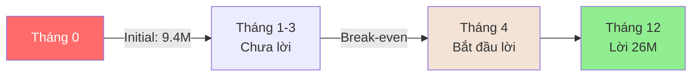

> 💡 **Kết luận**: Automation đáng đầu tư nếu test cases chạy lại nhiều lần!

---

## 🔺 Test Automation Pyramid

> **Test Pyramid** = Chiến lược phân bổ automation tests theo từng level

### Pyramid Model

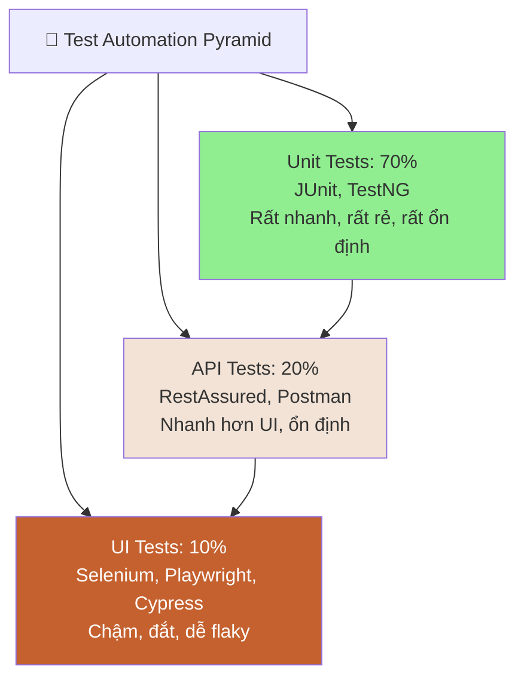

---

### Chi tiết từng level

| Level | % | Đặc điểm | Execution Time | Cost | Stability | Example |
|-------|---|----------|----------------|------|-----------|---------|
| **UI Tests** | 10% | - Test qua browser<br/>- Chậm nhất<br/>- Dễ break khi UI đổi | Minutes | Cao | Thấp (flaky) | Selenium click Login |
| **API Tests** | 20% | - Test backend APIs<br/>- Nhanh hơn UI<br/>- Không phụ thuộc UI | Seconds | Trung bình | Cao | POST /api/login |
| **Unit Tests** | 70% | - Test functions riêng lẻ<br/>- Rất nhanh<br/>- Không cần browser | Milliseconds | Thấp | Rất cao | assertEquals(add(2,3), 5) |

---

### Tại sao Pyramid?

#### ❌ Anti-pattern: Ice Cream Cone

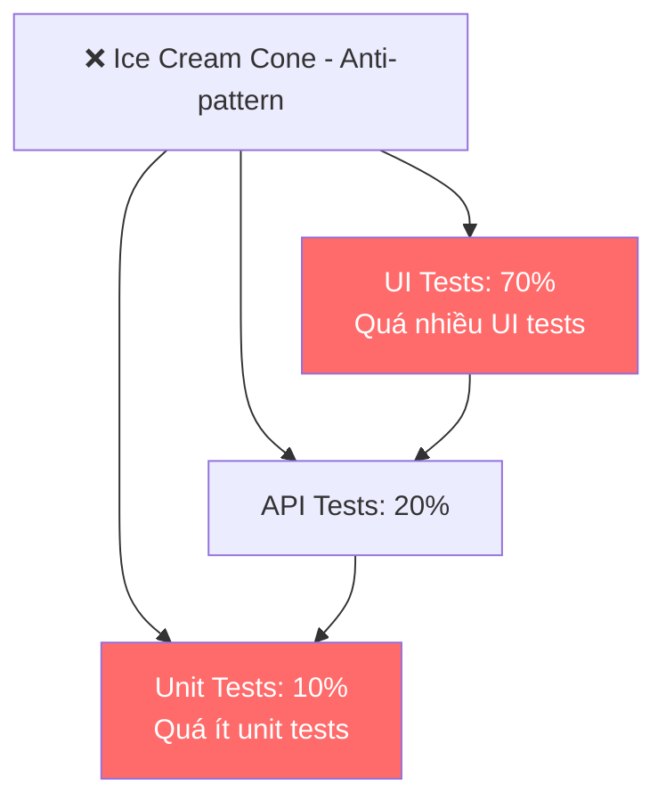

**Vấn đề**:
- ❌ Chậm (UI tests chiếm phần lớn)
- ❌ Flaky (UI tests không ổn định)
- ❌ Đắt (maintain UI tests tốn công)
- ❌ Feedback chậm (chờ lâu mới biết bugs)

---

#### ✅ Best Practice: Pyramid

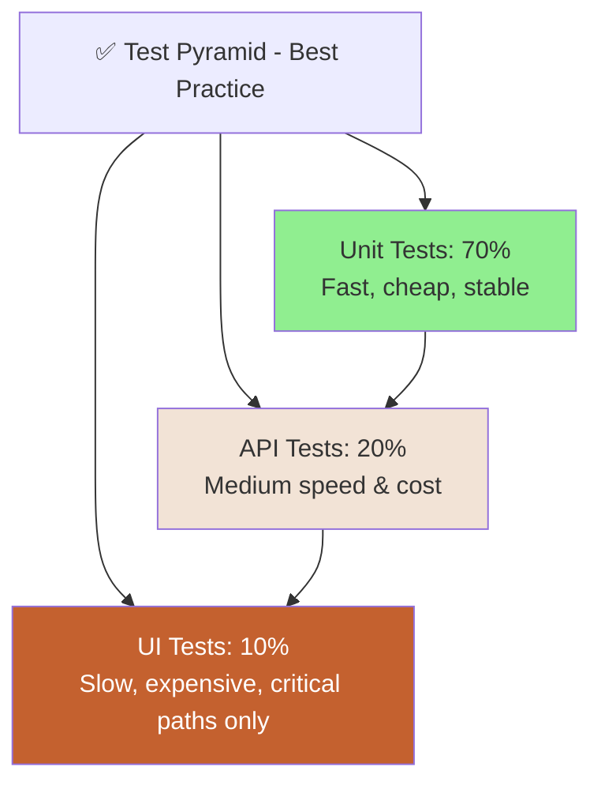

**Lợi ích**:
- ✅ Nhanh (70% unit tests chạy milliseconds)
- ✅ Ổn định (unit tests rất stable)
- ✅ Rẻ (ít UI tests → ít maintain)
- ✅ Feedback nhanh (phát hiện bugs sớm)

---

### Áp dụng cho Manual Tester

> 💡 **Trong khóa này**: Chúng ta focus vào **UI Tests với Selenium** (10% đỉnh pyramid)

**Tuy nhiên, bạn cần hiểu**:
- ⚠️ Không automate TẤT CẢ test cases bằng Selenium
- ⚠️ Chỉ automate critical user journeys
- ⚠️ Các test cases đơn giản → nên test ở API/Unit level

**Example**:
```
❌ SAI: Automate UI test cho "2 + 3 = 5"
✅ ĐÚNG: Unit test cho function add(2, 3)

❌ SAI: Selenium test xem database có save đúng không
✅ ĐÚNG: API test POST /users → verify trong database

✅ ĐÚNG: Selenium test cho end-to-end checkout flow
```

---

## 🔧 Selenium Ecosystem

> **Selenium** = Open-source tool suite để automate web browsers

### Selenium Suite

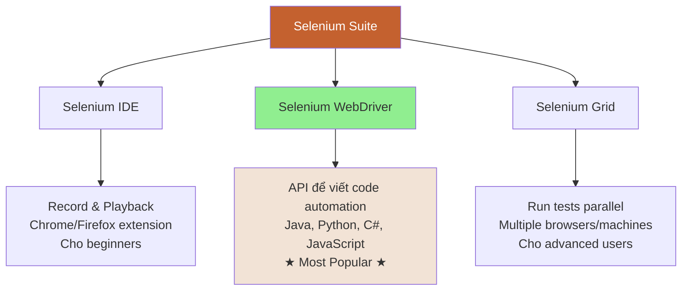

---

### Selenium WebDriver (Focus khóa học)

**Là gì?**
> API để điều khiển browser bằng code (Java, Python...)

**Architecture**:

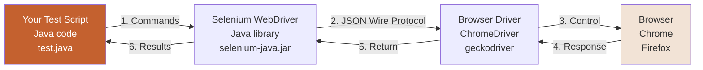

**Giải thích**:
1. Bạn viết code Java: `driver.findElement(By.id("email")).sendKeys("test@example.com")`
2. Selenium WebDriver nhận command
3. Gửi command đến ChromeDriver qua JSON
4. ChromeDriver điều khiển Chrome browser
5. Browser thực hiện action và trả kết quả
6. Kết quả về script của bạn

---

### Supported Browsers

| Browser | Driver | Auto-download (Selenium 4.6+) |
|---------|--------|-------------------------------|
| **Chrome** | ChromeDriver | ✅ Yes |
| **Firefox** | geckodriver | ✅ Yes |
| **Edge** | EdgeDriver | ✅ Yes |
| **Safari** | safaridriver | ✅ Built-in macOS |
| **Opera** | operadriver | ❌ Manual |

> 💡 **Selenium 4.6+**: Tự động download drivers, không cần manual setup!

---

### Supported Languages

| Language | Popularity | Recommend for |
|----------|------------|---------------|
| **Java** | ⭐⭐⭐⭐⭐ | Enterprise, nhiều job |
| **Python** | ⭐⭐⭐⭐ | Beginners, dễ học |
| **C#** | ⭐⭐⭐ | .NET shops |
| **JavaScript** | ⭐⭐⭐ | Frontend devs |
| **Ruby** | ⭐⭐ | Ít dùng |

> 💡 **Khóa này dùng Java** vì phổ biến nhất trong automation testing!

---

## ⚠️ Challenges trong Automation

### 7 thách thức chính

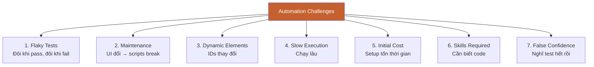

---

### Chi tiết & Solutions

| Challenge | Mô tả | Solution |
|-----------|-------|----------|
| **Flaky Tests** | Tests không consistent<br/>Lúc pass lúc fail | - Sử dụng **Explicit Waits**<br/>- Stable locators<br/>- Retry mechanism |
| **Maintenance** | UI thay đổi → scripts break<br/>Tốn thời gian fix | - **Page Object Model**<br/>- Modular code<br/>- Reusable methods |
| **Dynamic Elements** | ID/class thay đổi mỗi lần load | - Smart XPath/CSS<br/>- Relative locators<br/>- Không dùng absolute paths |
| **Slow Execution** | UI tests chạy chậm | - **Parallel execution**<br/>- Headless mode<br/>- Grid setup |
| **Initial Cost** | Viết scripts tốn thời gian | - Start small, prove ROI<br/>- Focus critical tests<br/>- Incremental approach |
| **Skills Gap** | Team cần biết code | - Training<br/>- Hire experienced<br/>- Pair programming |
| **False Confidence** | Automation ≠ test hết | - Combine manual + automation<br/>- Exploratory testing<br/>- Code reviews |

---

## ✅ TÓM TẮT BÀI HỌC

📌 **Automation Testing** = dùng tools/scripts để tự động chạy tests  
📌 **NÊN automate**: Regression, Smoke, Data-driven, Cross-browser tests  
📌 **KHÔNG nên automate**: One-time, Exploratory, Usability tests  
📌 **ROI**: Break-even sau ~3 tháng với regression tests  
📌 **Test Pyramid**: 70% Unit, 20% API, 10% UI tests  
📌 **Selenium WebDriver**: API để automate browsers bằng code  
📌 **Challenges**: Flaky tests, Maintenance, Dynamic elements  

---

## 🎯 SAU KHI HỌC BUỔI NÀY

### Bạn nên làm gì?

- [ ] Hiểu rõ khi nào nên/không nên automate
- [ ] Tính ROI cho 1 project của bạn (nếu có)
- [ ] Hiểu Test Automation Pyramid
- [ ] Hiểu Selenium architecture

### 📺 Video tiếng Việt nên xem

1. **[TEDU] - Automation Testing là gì?**
   - Overview về automation testing

2. **[Testing Aha] - Khi nào nên Automate?**
   - Decision framework chi tiết

### 🌐 Tài liệu tham khảo

1. **Selenium Official Docs**
   - Link: [https://www.selenium.dev/documentation/](https://www.selenium.dev/documentation/)

2. **Test Automation University**
   - Link: [https://testautomationu.applitools.com/](https://testautomationu.applitools.com/)
   - Free courses về automation

### ✍️ Thực hành

**Bài tập 1: Phân tích Test Cases**
- Chọn 20 test cases từ project của bạn
- Phân loại: Nên automate / Không nên automate
- Giải thích lý do

**Bài tập 2: Tính ROI**
- Project: 100 test cases
- Tính ROI cho automation
- Xác định break-even point

---

[📚 Quay lại Mục lục](README.md) | [Bài tiếp: Java Refresher →](02-java-refresher.md)

---

**Happy Testing!** 🎉  
*"Automation is not about replacing testers, it's about making them more efficient."*
