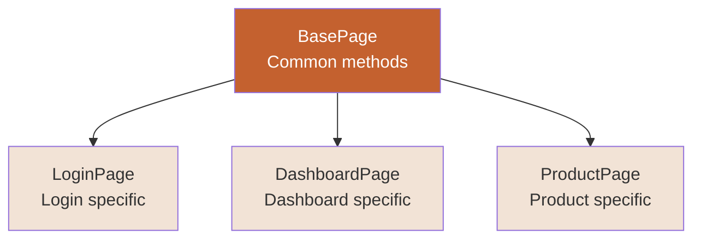
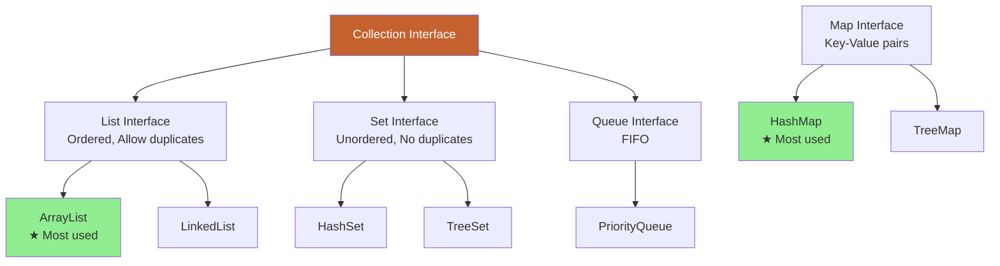
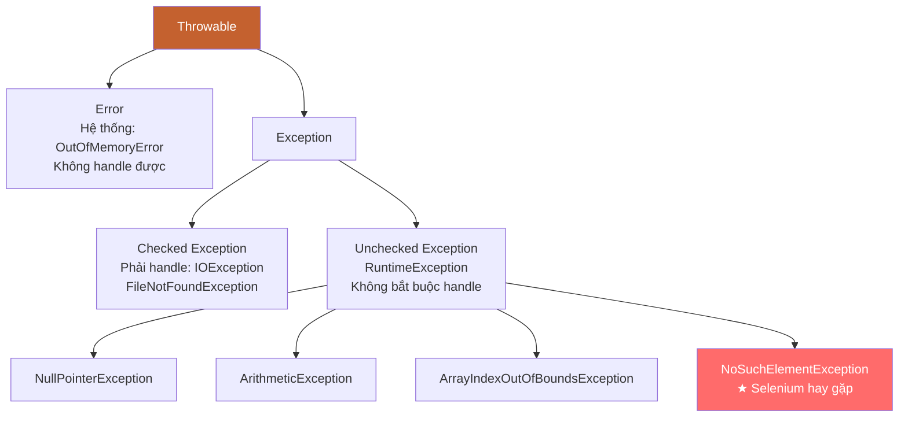

# ☕ PHẦN 2: JAVA REFRESHER CHO AUTOMATION

> **Mục tiêu**: Ôn lại những kiến thức Java cần thiết để viết Selenium automation scripts hiệu quả.

---

## 📑 MỤC LỤC

1. [OOP Recap](#oop-recap)
2. [Collections Framework](#collections-framework)
3. [Exception Handling](#exception-handling)
4. [File I/O](#file-io)
5. [Useful Java Features](#useful-java-features)

---

## 🎯 KIẾN THỨC CẦN NHỚ

> Phần này **KHÔNG dạy Java từ đầu**. Giả sử bạn đã biết Java basics (variables, loops, if-else...)  
> Chỉ **ôn lại** những phần quan trọng cho automation testing.

---

## 🏗️ OOP Recap

### Tại sao OOP quan trọng trong Automation?

```mermaid
graph LR
    A[OOP trong Automation]
    
    A --> B[Class<br/>LoginPage.java<br/>DashboardPage.java]
    
    A --> C[Object<br/>loginPage = new LoginPage()]
    
    A --> D[Inheritance<br/>BasePage → LoginPage]
    
    A --> E[Encapsulation<br/>private WebDriver]
    
    style A fill:#C4612F,color:#fff
    style B fill:#F2E3D6
    style C fill:#F2E3D6
    style D fill:#F2E3D6
    style E fill:#F2E3D6
```

---

### 1. Class & Object

**Class** = Blueprint (bản thiết kế)  
**Object** = Instance (thực thể được tạo từ class)

#### Example: Page Object Model

```java
// Class - Blueprint cho LoginPage
public class LoginPage {
    // Properties (fields)
    private WebDriver driver;
    private String emailFieldId = "input-email";
    private String passwordFieldId = "input-password";
    
    // Constructor
    public LoginPage(WebDriver driver) {
        this.driver = driver;
    }
    
    // Methods
    public void enterEmail(String email) {
        driver.findElement(By.id(emailFieldId)).sendKeys(email);
    }
    
    public void enterPassword(String password) {
        driver.findElement(By.id(passwordFieldId)).sendKeys(password);
    }
    
    public void clickLoginButton() {
        driver.findElement(By.cssSelector("input[type='submit']")).click();
    }
    
    // Business method
    public void login(String email, String password) {
        enterEmail(email);
        enterPassword(password);
        clickLoginButton();
    }
}

// Object - Tạo instance
LoginPage loginPage = new LoginPage(driver);
loginPage.login("test@example.com", "Test@123");
```

**Lợi ích**:
- ✅ Code tái sử dụng (reusable)
- ✅ Dễ maintain
- ✅ Readable

---

### 2. Inheritance

> **Inheritance** = Class con kế thừa properties/methods từ class cha



#### Example: Framework Structure

```java
// Base Page - Chứa common methods
public class BasePage {
    protected WebDriver driver;
    
    public BasePage(WebDriver driver) {
        this.driver = driver;
    }
    
    // Common method - tất cả pages dùng chung
    public void waitForElement(By locator, int seconds) {
        WebDriverWait wait = new WebDriverWait(driver, Duration.ofSeconds(seconds));
        wait.until(ExpectedConditions.visibilityOfElementLocated(locator));
    }
    
    public void clickElement(By locator) {
        waitForElement(locator, 10);
        driver.findElement(locator).click();
    }
    
    public String getPageTitle() {
        return driver.getTitle();
    }
}

// Login Page - Kế thừa BasePage
public class LoginPage extends BasePage {
    // Locators
    private By emailField = By.id("input-email");
    private By passwordField = By.id("input-password");
    private By loginButton = By.cssSelector("input[type='submit']");
    
    // Constructor
    public LoginPage(WebDriver driver) {
        super(driver); // Gọi constructor của BasePage
    }
    
    // Login specific method
    public void login(String email, String password) {
        driver.findElement(emailField).sendKeys(email);
        driver.findElement(passwordField).sendKeys(password);
        
        // Sử dụng method từ BasePage
        clickElement(loginButton);
    }
}

// Dashboard Page - Cũng kế thừa BasePage
public class DashboardPage extends BasePage {
    private By welcomeMessage = By.cssSelector(".welcome-msg");
    
    public DashboardPage(WebDriver driver) {
        super(driver);
    }
    
    public String getWelcomeMessage() {
        waitForElement(welcomeMessage, 10); // Method từ BasePage
        return driver.findElement(welcomeMessage).getText();
    }
}
```

**Lợi ích**:
- ✅ Tránh duplicate code
- ✅ Tất cả pages có common methods
- ✅ Update 1 chỗ → tất cả pages được update

---

### 3. Polymorphism

> **Polymorphism** = Một method có thể có nhiều hình thức (overloading/overriding)

#### Method Overloading (cùng tên, khác parameters)

```java
public class TestUtils {
    // Overloading - 3 methods cùng tên "click"
    
    // Click by By locator
    public void click(By locator) {
        driver.findElement(locator).click();
    }
    
    // Click by WebElement
    public void click(WebElement element) {
        element.click();
    }
    
    // Click with wait
    public void click(By locator, int timeout) {
        WebDriverWait wait = new WebDriverWait(driver, Duration.ofSeconds(timeout));
        wait.until(ExpectedConditions.elementToBeClickable(locator)).click();
    }
}

// Usage
TestUtils utils = new TestUtils();
utils.click(By.id("login"));              // Method 1
utils.click(driver.findElement(By.id("login"))); // Method 2
utils.click(By.id("login"), 10);          // Method 3
```

---

#### Method Overriding (class con ghi đè method của class cha)

```java
// Base Test
public class BaseTest {
    public void setup() {
        System.out.println("Base setup: Launch browser");
        driver = new ChromeDriver();
    }
}

// Login Test - Override setup
public class LoginTest extends BaseTest {
    @Override
    public void setup() {
        super.setup(); // Gọi base setup trước
        System.out.println("Login setup: Navigate to login page");
        driver.get("https://example.com/login");
    }
}
```

---

### 4. Encapsulation

> **Encapsulation** = Giấu data (private) và cung cấp access qua public methods (getters/setters)

```java
public class User {
    // Private fields - không access trực tiếp từ bên ngoài
    private String username;
    private String password;
    private String email;
    
    // Constructor
    public User(String username, String password, String email) {
        this.username = username;
        this.password = password;
        this.email = email;
    }
    
    // Public getters
    public String getUsername() {
        return username;
    }
    
    public String getPassword() {
        return password;
    }
    
    public String getEmail() {
        return email;
    }
    
    // Public setters với validation
    public void setPassword(String password) {
        if (password.length() >= 8) {
            this.password = password;
        } else {
            throw new IllegalArgumentException("Password phải >= 8 ký tự");
        }
    }
}

// Usage
User user = new User("testuser", "Test@123", "test@example.com");

// ❌ Không thể: user.password (private)
// ✅ Được: 
String pwd = user.getPassword();
user.setPassword("NewPassword@123");
```

**Lợi ích trong Automation**:
- ✅ Data an toàn (không ai sửa trực tiếp)
- ✅ Có validation khi set values
- ✅ Dễ maintain

---

## 📦 Collections Framework

> **Collections** = Cấu trúc dữ liệu để lưu nhiều elements (như arrays nhưng powerful hơn)

### Collections Hierarchy



---

### 1. ArrayList (★ Dùng nhiều nhất)

> **ArrayList** = Dynamic array (size tự động tăng/giảm)

```java
// Tạo ArrayList
List<String> browsers = new ArrayList<>();

// Add elements
browsers.add("Chrome");
browsers.add("Firefox");
browsers.add("Safari");
browsers.add("Edge");

// Get element
String firstBrowser = browsers.get(0); // "Chrome"

// Size
int count = browsers.size(); // 4

// Loop qua ArrayList
for (String browser : browsers) {
    System.out.println(browser);
}

// Remove
browsers.remove("Safari");
browsers.remove(0); // Remove by index

// Check contains
if (browsers.contains("Chrome")) {
    System.out.println("Chrome is in list");
}

// Clear all
browsers.clear();
```

#### Example: Automation Use Case

```java
// Lấy tất cả links trên page
List<WebElement> links = driver.findElements(By.tagName("a"));

// Lưu href vào ArrayList
List<String> allLinks = new ArrayList<>();
for (WebElement link : links) {
    allLinks.add(link.getAttribute("href"));
}

// In ra tất cả links
System.out.println("Total links: " + allLinks.size());
for (String link : allLinks) {
    System.out.println(link);
}
```

---

### 2. HashMap (★ Dùng nhiều nhất cho key-value)

> **HashMap** = Lưu data dạng key-value pairs

```java
// Tạo HashMap
Map<String, String> credentials = new HashMap<>();

// Put key-value
credentials.put("username", "test@example.com");
credentials.put("password", "Test@123");
credentials.put("env", "QA");

// Get value by key
String username = credentials.get("username"); // "test@example.com"

// Check key exists
if (credentials.containsKey("username")) {
    System.out.println("Username found");
}

// Loop qua HashMap
for (Map.Entry<String, String> entry : credentials.entrySet()) {
    System.out.println(entry.getKey() + " : " + entry.getValue());
}

// Remove
credentials.remove("env");

// Size
int size = credentials.size(); // 2
```

#### Example: Test Data Management

```java
// Lưu test users
Map<String, String> testUsers = new HashMap<>();
testUsers.put("admin", "Admin@123");
testUsers.put("user1", "User1@123");
testUsers.put("user2", "User2@123");

// Login với admin
String adminPassword = testUsers.get("admin");
loginPage.login("admin@example.com", adminPassword);

// Lưu test data phức tạp hơn
Map<String, Map<String, String>> users = new HashMap<>();

Map<String, String> admin = new HashMap<>();
admin.put("email", "admin@example.com");
admin.put("password", "Admin@123");
admin.put("role", "admin");

Map<String, String> user = new HashMap<>();
user.put("email", "user@example.com");
user.put("password", "User@123");
user.put("role", "user");

users.put("admin", admin);
users.put("user1", user);

// Access
String adminEmail = users.get("admin").get("email");
```

---

### 3. HashSet (Không cho phép duplicates)

```java
// Tạo HashSet
Set<String> uniqueBrowsers = new HashSet<>();

// Add elements
uniqueBrowsers.add("Chrome");
uniqueBrowsers.add("Firefox");
uniqueBrowsers.add("Chrome"); // Duplicate - sẽ bị ignore

System.out.println(uniqueBrowsers.size()); // 2 (không có duplicate)

// Loop
for (String browser : uniqueBrowsers) {
    System.out.println(browser);
}
```

#### Example: Remove Duplicate Links

```java
// Lấy tất cả links (có thể có duplicates)
List<WebElement> linkElements = driver.findElements(By.tagName("a"));

// Lưu vào HashSet để remove duplicates
Set<String> uniqueLinks = new HashSet<>();
for (WebElement link : linkElements) {
    uniqueLinks.add(link.getAttribute("href"));
}

System.out.println("Total links: " + linkElements.size());
System.out.println("Unique links: " + uniqueLinks.size());
```

---

### So sánh List vs Set vs Map

| Feature | ArrayList | HashSet | HashMap |
|---------|-----------|---------|---------|
| **Duplicates** | ✅ Allow | ❌ No duplicates | Keys: ❌<br/>Values: ✅ |
| **Order** | ✅ Ordered (insertion order) | ❌ Unordered | ❌ Unordered |
| **Null values** | ✅ Allow multiple | ✅ Allow one null | Key: 1 null<br/>Value: Multiple |
| **Access** | By index: `get(0)` | Loop only | By key: `get("key")` |
| **Use case** | List of items | Unique items | Key-value pairs |

---

## ⚠️ Exception Handling

> **Exception** = Lỗi xảy ra runtime (không phải compile error)

### Exception Hierarchy



---

### Try-Catch-Finally

```java
try {
    // Code có thể throw exception
    WebElement element = driver.findElement(By.id("nonexistent"));
    element.click();
    
} catch (NoSuchElementException e) {
    // Handle exception
    System.out.println("Element không tìm thấy: " + e.getMessage());
    
} finally {
    // Code luôn chạy (dù có exception hay không)
    System.out.println("Cleanup code");
}
```

---

### Common Selenium Exceptions

```java
public class ExceptionExamples {
    
    // 1. NoSuchElementException - Element không tồn tại
    public void example1() {
        try {
            driver.findElement(By.id("wrong-id")).click();
        } catch (NoSuchElementException e) {
            System.out.println("Element không tìm thấy");
            // Screenshot on failure
            takeScreenshot("element-not-found");
        }
    }
    
    // 2. TimeoutException - Quá timeout
    public void example2() {
        try {
            WebDriverWait wait = new WebDriverWait(driver, Duration.ofSeconds(5));
            wait.until(ExpectedConditions.visibilityOfElementLocated(By.id("slow-element")));
        } catch (TimeoutException e) {
            System.out.println("Element không xuất hiện sau 5 giây");
        }
    }
    
    // 3. StaleElementReferenceException - Element đã stale (DOM changed)
    public void example3() {
        WebElement element = driver.findElement(By.id("dynamic"));
        
        // DOM refresh (AJAX call)
        driver.navigate().refresh();
        
        try {
            element.click(); // Sẽ throw StaleElementReferenceException
        } catch (StaleElementReferenceException e) {
            System.out.println("Element đã stale, tìm lại");
            element = driver.findElement(By.id("dynamic")); // Tìm lại
            element.click();
        }
    }
    
    // 4. ElementNotInteractableException - Element không thể interact
    public void example4() {
        try {
            WebElement hiddenElement = driver.findElement(By.id("hidden"));
            hiddenElement.click(); // Element bị hidden
        } catch (ElementNotInteractableException e) {
            System.out.println("Element không visible hoặc bị che");
            // Solution: Scroll to element hoặc dùng JavascriptExecutor
        }
    }
}
```

---

### Best Practices

```java
// ✅ ĐÚNG: Catch specific exception
try {
    driver.findElement(By.id("element")).click();
} catch (NoSuchElementException e) {
    // Handle specific case
    System.out.println("Element not found: " + e.getMessage());
} catch (TimeoutException e) {
    System.out.println("Timeout: " + e.getMessage());
}

// ❌ SAI: Catch tất cả exceptions
try {
    driver.findElement(By.id("element")).click();
} catch (Exception e) {
    // Quá generic, không biết lỗi gì
    System.out.println("Có lỗi");
}
```

---

### Custom Exception

```java
// Tạo custom exception
public class ElementNotFoundException extends Exception {
    public ElementNotFoundException(String message) {
        super(message);
    }
}

// Sử dụng
public WebElement findElementSafely(By locator) throws ElementNotFoundException {
    try {
        return driver.findElement(locator);
    } catch (NoSuchElementException e) {
        throw new ElementNotFoundException("Không tìm thấy element: " + locator);
    }
}

// Test method
@Test
public void testLogin() {
    try {
        WebElement emailField = findElementSafely(By.id("email"));
        emailField.sendKeys("test@example.com");
    } catch (ElementNotFoundException e) {
        System.out.println(e.getMessage());
        Assert.fail("Test failed: " + e.getMessage());
    }
}
```

---

## 📄 File I/O

> **File I/O** = Đọc/ghi files (test data, config, screenshots...)

### Đọc File - Properties File

**config.properties**:
```properties
browser=chrome
url=https://demo.opencart.com
username=test@example.com
password=Test@123
timeout=10
```

**Đọc file**:
```java
import java.io.FileInputStream;
import java.util.Properties;

public class ConfigReader {
    private Properties properties;
    
    public ConfigReader(String filePath) {
        try {
            FileInputStream fis = new FileInputStream(filePath);
            properties = new Properties();
            properties.load(fis);
            fis.close();
        } catch (Exception e) {
            e.printStackTrace();
        }
    }
    
    public String getBrowser() {
        return properties.getProperty("browser");
    }
    
    public String getUrl() {
        return properties.getProperty("url");
    }
    
    public String getUsername() {
        return properties.getProperty("username");
    }
    
    public String getPassword() {
        return properties.getProperty("password");
    }
    
    public int getTimeout() {
        return Integer.parseInt(properties.getProperty("timeout"));
    }
}

// Usage
ConfigReader config = new ConfigReader("config.properties");
String browser = config.getBrowser(); // "chrome"
String url = config.getUrl();
```

---

### Đọc File - Text File

**testdata.txt**:
```
test1@example.com,Pass@123
test2@example.com,Pass@456
test3@example.com,Pass@789
```

**Đọc file**:
```java
import java.io.BufferedReader;
import java.io.FileReader;
import java.util.ArrayList;
import java.util.List;

public class TextFileReader {
    public static List<String[]> readTestData(String filePath) {
        List<String[]> data = new ArrayList<>();
        
        try {
            BufferedReader reader = new BufferedReader(new FileReader(filePath));
            String line;
            
            while ((line = reader.readLine()) != null) {
                String[] parts = line.split(",");
                data.add(parts);
            }
            
            reader.close();
        } catch (Exception e) {
            e.printStackTrace();
        }
        
        return data;
    }
}

// Usage
List<String[]> testData = TextFileReader.readTestData("testdata.txt");
for (String[] row : testData) {
    String email = row[0];
    String password = row[1];
    System.out.println("Email: " + email + ", Password: " + password);
}
```

---

### Ghi File - Log File

```java
import java.io.FileWriter;
import java.io.BufferedWriter;
import java.time.LocalDateTime;
import java.time.format.DateTimeFormatter;

public class LogWriter {
    private String logFilePath = "test-log.txt";
    
    public void writeLog(String message) {
        try {
            FileWriter fw = new FileWriter(logFilePath, true); // true = append mode
            BufferedWriter bw = new BufferedWriter(fw);
            
            // Add timestamp
            String timestamp = LocalDateTime.now()
                .format(DateTimeFormatter.ofPattern("yyyy-MM-dd HH:mm:ss"));
            
            bw.write("[" + timestamp + "] " + message);
            bw.newLine();
            bw.close();
            
        } catch (Exception e) {
            e.printStackTrace();
        }
    }
}

// Usage
LogWriter logger = new LogWriter();
logger.writeLog("Test started");
logger.writeLog("Login successful");
logger.writeLog("Test completed");
```

---

## 🔧 Useful Java Features

### 1. String Methods (hay dùng)

```java
String text = "  Hello Selenium  ";

// Length
int length = text.length(); // 18

// Trim whitespace
String trimmed = text.trim(); // "Hello Selenium"

// Uppercase/Lowercase
String upper = text.toUpperCase(); // "  HELLO SELENIUM  "
String lower = text.toLowerCase(); // "  hello selenium  "

// Contains
boolean hasSelenium = text.contains("Selenium"); // true

// StartsWith/EndsWith
boolean starts = text.trim().startsWith("Hello"); // true
boolean ends = text.trim().endsWith("Selenium"); // true

// Replace
String replaced = text.replace("Selenium", "Java"); // "  Hello Java  "

// Split
String csv = "email,password,username";
String[] parts = csv.split(","); // ["email", "password", "username"]

// Substring
String sub = "Hello".substring(0, 4); // "Hell"

// Equals (case-sensitive)
boolean equals = "Hello".equals("hello"); // false

// EqualsIgnoreCase
boolean equalsIgnore = "Hello".equalsIgnoreCase("hello"); // true
```

#### Example: Verify Text

```java
// Get text from element
WebElement message = driver.findElement(By.id("success-msg"));
String actualText = message.getText().trim();

// Verify contains
if (actualText.contains("successfully")) {
    System.out.println("Success message displayed");
}

// Verify equals
String expectedText = "Login successfully";
if (actualText.equalsIgnoreCase(expectedText)) {
    System.out.println("Text matched");
}
```

---

### 2. Date & Time

```java
import java.time.LocalDate;
import java.time.LocalDateTime;
import java.time.format.DateTimeFormatter;

// Current date
LocalDate today = LocalDate.now();
System.out.println(today); // 2024-07-04

// Current date & time
LocalDateTime now = LocalDateTime.now();
System.out.println(now); // 2024-07-04T15:30:45

// Format date
DateTimeFormatter formatter = DateTimeFormatter.ofPattern("dd-MM-yyyy HH:mm:ss");
String formatted = now.format(formatter); // "04-07-2024 15:30:45"

// Parse date from string
String dateStr = "2024-07-04";
LocalDate parsedDate = LocalDate.parse(dateStr);

// Add/Subtract days
LocalDate tomorrow = today.plusDays(1);
LocalDate yesterday = today.minusDays(1);
```

#### Example: Screenshot with Timestamp

```java
public void takeScreenshot(String testName) {
    try {
        // Add timestamp to filename
        String timestamp = LocalDateTime.now()
            .format(DateTimeFormatter.ofPattern("yyyyMMdd_HHmmss"));
        
        String fileName = testName + "_" + timestamp + ".png";
        
        TakesScreenshot ts = (TakesScreenshot) driver;
        File source = ts.getScreenshotAs(OutputType.FILE);
        File destination = new File("screenshots/" + fileName);
        
        Files.copy(source.toPath(), destination.toPath());
        
    } catch (Exception e) {
        e.printStackTrace();
    }
}

// Usage
takeScreenshot("login_test");
// Output: screenshots/login_test_20240704_153045.png
```

---

### 3. Random Data Generation

```java
import java.util.Random;
import java.util.UUID;

public class DataGenerator {
    
    // Random number
    public int getRandomNumber(int min, int max) {
        Random random = new Random();
        return random.nextInt(max - min + 1) + min;
    }
    
    // Random email
    public String getRandomEmail() {
        String uuid = UUID.randomUUID().toString().substring(0, 8);
        return "test_" + uuid + "@example.com";
    }
    
    // Random phone
    public String getRandomPhone() {
        Random random = new Random();
        return "09" + (100000000 + random.nextInt(900000000));
    }
}

// Usage
DataGenerator generator = new DataGenerator();
String email = generator.getRandomEmail(); // test_a3f4b2e1@example.com
String phone = generator.getRandomPhone(); // 0987654321
int age = generator.getRandomNumber(18, 65); // Random age 18-65
```

---

## ✅ TÓM TẮT BÀI HỌC

📌 **OOP**: Class, Object, Inheritance, Polymorphism, Encapsulation  
📌 **Collections**: ArrayList (list items), HashMap (key-value), HashSet (unique)  
📌 **Exception Handling**: Try-Catch-Finally, Common Selenium exceptions  
📌 **File I/O**: Đọc config file, test data file, ghi log file  
📌 **Useful Features**: String methods, Date/Time, Random data  

---

## 🎯 SAU KHI HỌC BUỔI NÀY

### Checklist

- [ ] Hiểu OOP concepts trong automation context
- [ ] Biết dùng ArrayList và HashMap
- [ ] Biết handle exceptions trong Selenium
- [ ] Biết đọc/ghi files cho test data

### 📝 Thực hành

**Bài 1: OOP Practice**
```java
// Tạo class User với:
// - Properties: email, password, firstName, lastName
// - Constructor
// - Getters/Setters
// - Method: getFullName()
```

**Bài 2: Collections Practice**
```java
// Tạo HashMap chứa 5 test users
// Loop qua và in ra email + password của từng user
```

**Bài 3: Exception Handling**
```java
// Viết method findElementSafely() với try-catch
// Nếu không tìm thấy element → return null thay vì throw exception
```

---

[← Bài trước: Automation Fundamentals](01-automation-testing-fundamentals.md) | [Bài tiếp: Maven →](03-maven-build-tool.md)

---

**Happy Coding!** ☕  
*"Good code is its own best documentation."*
