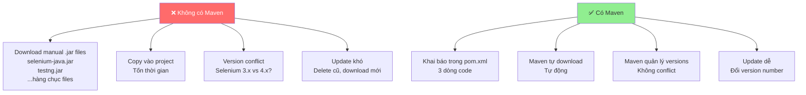
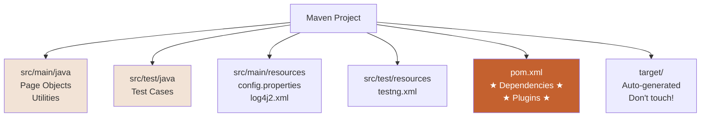
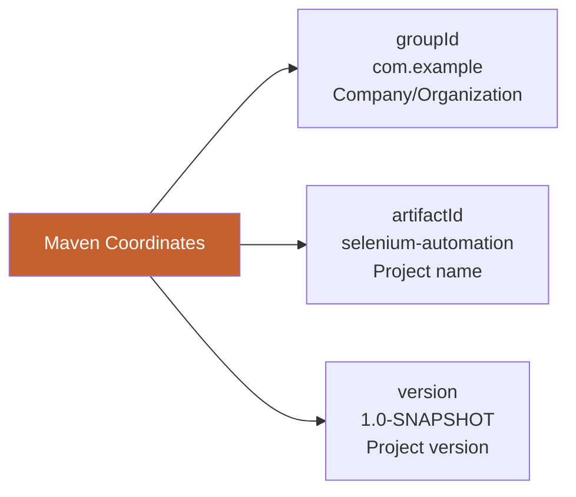
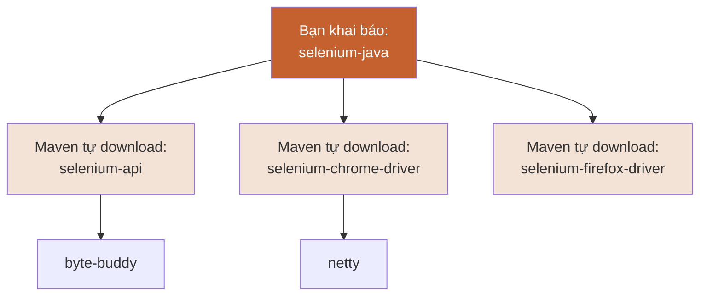
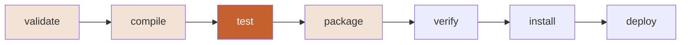
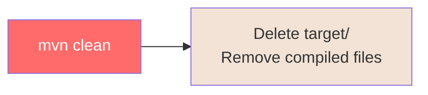
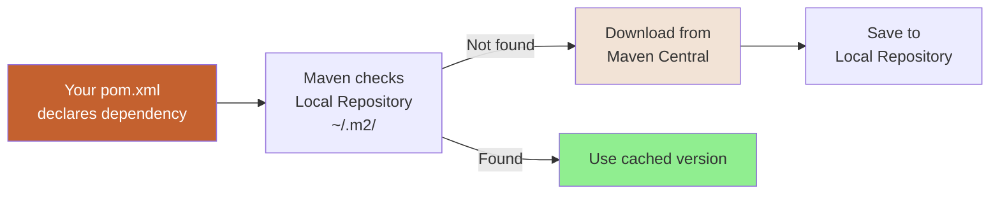

# 🔧 PHẦN 3: MAVEN - BUILD TOOL

> **Mục tiêu**: Hiểu Maven là gì, cách quản lý dependencies, và sử dụng Maven commands cho automation project.

---

## 📑 MỤC LỤC

1. [Maven là gì?](#maven-là-gì)
2. [Maven Project Structure](#maven-project-structure)
3. [pom.xml - Project Object Model](#pomxml---project-object-model)
4. [Dependencies Management](#dependencies-management)
5. [Maven Lifecycle](#maven-lifecycle)
6. [Maven Commands](#maven-commands)
7. [Tạo Maven Project](#tạo-maven-project)

---

## 🎯 Maven là gì?

> **Maven** = Build automation và dependency management tool cho Java projects

### Maven giải quyết vấn đề gì?



---

### Maven vs Manual

| Tiêu chí | Manual (Không Maven) | Maven |
|----------|----------------------|-------|
| **Download .jar** | ❌ Manual download | ✅ Tự động |
| **Quản lý versions** | ❌ Khó, dễ conflict | ✅ Maven lo |
| **Dependencies của dependencies** | ❌ Phải tự download | ✅ Maven tự resolve |
| **Build project** | ❌ IDE-specific | ✅ Chuẩn, any IDE |
| **Share project** | ❌ Phải share .jar files | ✅ Chỉ share pom.xml |
| **Update libraries** | ❌ Xóa cũ, download mới | ✅ Đổi version number |

---

## 📁 Maven Project Structure

### Standard Directory Layout

```
my-selenium-project/
│
├── src/
│   ├── main/
│   │   ├── java/                  # Main source code
│   │   │   └── com/
│   │   │       └── example/
│   │   │           └── pages/
│   │   │               ├── LoginPage.java
│   │   │               └── DashboardPage.java
│   │   │
│   │   └── resources/             # Config files, test data
│   │       ├── config.properties
│   │       └── log4j2.xml
│   │
│   └── test/
│       ├── java/                  # Test source code
│       │   └── com/
│       │       └── example/
│       │           └── tests/
│       │               ├── LoginTest.java
│       │               └── DashboardTest.java
│       │
│       └── resources/             # Test config files
│           └── testng.xml
│
├── target/                        # Build output (generated by Maven)
│   ├── classes/                   # Compiled .class files
│   ├── test-classes/              # Compiled test .class files
│   └── surefire-reports/          # Test reports
│
├── pom.xml                        # ★ Maven config file ★
└── README.md
```

**Lưu ý quan trọng**:
- ✅ **src/main/java**: Code chính (Page Objects, utilities)
- ✅ **src/test/java**: Test cases
- ✅ **src/main/resources**: Config files
- ✅ **pom.xml**: Maven configuration (quan trọng nhất!)
- ⚠️ **target/**: Tự động generate, không commit vào Git

---

### Visualize Structure



---

## 📄 pom.xml - Project Object Model

> **pom.xml** = File cấu hình chính của Maven project

### Basic pom.xml Structure

```xml
<?xml version="1.0" encoding="UTF-8"?>
<project xmlns="http://maven.apache.org/POM/4.0.0"
         xmlns:xsi="http://www.w3.org/2001/XMLSchema-instance"
         xsi:schemaLocation="http://maven.apache.org/POM/4.0.0 
         http://maven.apache.org/xsd/maven-4.0.0.xsd">
    
    <modelVersion>4.0.0</modelVersion>
    
    <!-- 1. PROJECT INFORMATION -->
    <groupId>com.example</groupId>
    <artifactId>selenium-automation</artifactId>
    <version>1.0-SNAPSHOT</version>
    <packaging>jar</packaging>
    
    <name>Selenium Automation Framework</name>
    <description>Automation testing với Selenium WebDriver</description>
    
    <!-- 2. PROPERTIES -->
    <properties>
        <maven.compiler.source>11</maven.compiler.source>
        <maven.compiler.target>11</maven.compiler.target>
        <project.build.sourceEncoding>UTF-8</project.build.sourceEncoding>
    </properties>
    
    <!-- 3. DEPENDENCIES -->
    <dependencies>
        <!-- Dependencies sẽ khai báo ở đây -->
    </dependencies>
    
    <!-- 4. BUILD PLUGINS -->
    <build>
        <plugins>
            <!-- Plugins sẽ khai báo ở đây -->
        </plugins>
    </build>
    
</project>
```

---

### Giải thích các phần

#### 1. Project Coordinates

```xml
<groupId>com.example</groupId>
<artifactId>selenium-automation</artifactId>
<version>1.0-SNAPSHOT</version>
```



**Ví dụ**:
- `groupId`: `com.example` (company domain ngược)
- `artifactId`: `selenium-automation` (tên project)
- `version`: `1.0-SNAPSHOT` (version đang develop)

---

#### 2. Properties

```xml
<properties>
    <maven.compiler.source>11</maven.compiler.source>
    <maven.compiler.target>11</maven.compiler.target>
    <project.build.sourceEncoding>UTF-8</project.build.sourceEncoding>
    
    <!-- Custom properties -->
    <selenium.version>4.15.0</selenium.version>
    <testng.version>7.8.0</testng.version>
</properties>
```

**Giải thích**:
- `maven.compiler.source`: Java version để compile
- `selenium.version`: Tạo variable để dễ update version

**Sử dụng properties**:
```xml
<dependency>
    <groupId>org.seleniumhq.selenium</groupId>
    <artifactId>selenium-java</artifactId>
    <version>${selenium.version}</version>
</dependency>
```

---

## 📦 Dependencies Management

### Thêm Dependencies

#### 1. Selenium WebDriver

```xml
<dependencies>
    <!-- Selenium Java -->
    <dependency>
        <groupId>org.seleniumhq.selenium</groupId>
        <artifactId>selenium-java</artifactId>
        <version>4.15.0</version>
    </dependency>
</dependencies>
```

**Tìm dependency ở đâu?**
👉 [Maven Central Repository](https://mvnrepository.com/)

---

#### 2. TestNG

```xml
<dependency>
    <groupId>org.testng</groupId>
    <artifactId>testng</artifactId>
    <version>7.8.0</version>
    <scope>test</scope>
</dependency>
```

**Scope là gì?**

| Scope | Khi nào dùng? | Example |
|-------|---------------|---------|
| **compile** (default) | Cần cho compile và runtime | Selenium |
| **test** | Chỉ cần khi run tests | TestNG, JUnit |
| **provided** | Container cung cấp (Servlet) | Servlet API |
| **runtime** | Chỉ cần khi runtime | JDBC drivers |

---

#### 3. Complete Dependencies Example

```xml
<dependencies>
    <!-- Selenium WebDriver -->
    <dependency>
        <groupId>org.seleniumhq.selenium</groupId>
        <artifactId>selenium-java</artifactId>
        <version>4.15.0</version>
    </dependency>
    
    <!-- TestNG -->
    <dependency>
        <groupId>org.testng</groupId>
        <artifactId>testng</artifactId>
        <version>7.8.0</version>
        <scope>test</scope>
    </dependency>
    
    <!-- WebDriverManager (Optional - tự động download drivers) -->
    <dependency>
        <groupId>io.github.bonigarcia</groupId>
        <artifactId>webdrivermanager</artifactId>
        <version>5.6.2</version>
    </dependency>
    
    <!-- Apache POI (Đọc Excel) -->
    <dependency>
        <groupId>org.apache.poi</groupId>
        <artifactId>poi-ooxml</artifactId>
        <version>5.2.5</version>
    </dependency>
    
    <!-- Log4j (Logging) -->
    <dependency>
        <groupId>org.apache.logging.log4j</groupId>
        <artifactId>log4j-core</artifactId>
        <version>2.21.1</version>
    </dependency>
    
    <!-- ExtentReports (Reporting) -->
    <dependency>
        <groupId>com.aventstack</groupId>
        <artifactId>extentreports</artifactId>
        <version>5.1.1</version>
    </dependency>
</dependencies>
```

---

### Transitive Dependencies

> **Transitive Dependencies** = Dependencies của dependencies (Maven tự động download)



**Ví dụ**:
- Bạn chỉ khai báo: `selenium-java`
- Maven tự download: 30+ jar files (selenium-api, chrome-driver, firefox-driver, dependencies của chúng...)

---

## 🔄 Maven Lifecycle

> **Maven Lifecycle** = Các phases (giai đoạn) khi build project

### Standard Lifecycle



---

### Chi tiết các Phases

| Phase | Mô tả | Output |
|-------|-------|--------|
| **validate** | Validate project structure | - |
| **compile** | Compile source code (src/main/java) | target/classes/ |
| **test** | Run unit tests (src/test/java) | target/test-classes/<br/>target/surefire-reports/ |
| **package** | Đóng gói thành JAR/WAR | target/project-name.jar |
| **verify** | Run integration tests, verify | - |
| **install** | Install vào local repository | ~/.m2/repository/ |
| **deploy** | Deploy lên remote repository | Remote server |

---

### Clean Lifecycle



**Khi nào dùng?**
- Trước khi build mới (clean slate)
- Khi có vấn đề với compiled files
- Khi đổi code nhưng không reflect

---

## 💻 Maven Commands

### Basic Commands

#### 1. Clean

```bash
mvn clean
```

**Chức năng**: Xóa folder `target/`

**Output**:
```
[INFO] Deleting target
[INFO] BUILD SUCCESS
```

---

#### 2. Compile

```bash
mvn compile
```

**Chức năng**: Compile code trong `src/main/java`

**Output**:
```
[INFO] Compiling 10 source files to target/classes
[INFO] BUILD SUCCESS
```

---

#### 3. Test

```bash
mvn test
```

**Chức năng**: 
- Compile `src/test/java`
- Run tất cả test cases

**Output**:
```
[INFO] Running com.example.tests.LoginTest
[INFO] Tests run: 3, Failures: 0, Errors: 0, Skipped: 0
[INFO] BUILD SUCCESS
```

---

#### 4. Package

```bash
mvn package
```

**Chức năng**: Tạo JAR file

**Output**: `target/selenium-automation-1.0-SNAPSHOT.jar`

---

### Combined Commands

```bash
# Clean + Compile
mvn clean compile

# Clean + Test (★ Hay dùng nhất)
mvn clean test

# Clean + Package
mvn clean package

# Clean + Install
mvn clean install
```

---

### Advanced Commands

#### Run specific TestNG suite

```bash
mvn test -DsuiteXmlFile=testng-smoke.xml
```

#### Skip tests

```bash
mvn clean package -DskipTests
```

#### Run with specific browser

```bash
mvn test -Dbrowser=firefox
```

#### Parallel execution

```bash
mvn test -Dthreadcount=3
```

---

## 🚀 Tạo Maven Project

### Option 1: IntelliJ IDEA (Recommend)

**Step 1**: File → New → Project

**Step 2**: Chọn Maven

**Step 3**: Điền thông tin
```
Name: selenium-automation
Location: C:\automation-projects\
GroupId: com.example
ArtifactId: selenium-automation
```

**Step 4**: Click Create

**Step 5**: IntelliJ tự generate structure + pom.xml

---

### Option 2: Command Line

```bash
mvn archetype:generate \
  -DgroupId=com.example \
  -DartifactId=selenium-automation \
  -DarchetypeArtifactId=maven-archetype-quickstart \
  -DinteractiveMode=false
```

---

### Option 3: Manual

**Step 1**: Tạo folders
```
mkdir selenium-automation
cd selenium-automation
mkdir -p src/main/java
mkdir -p src/test/java
mkdir -p src/main/resources
mkdir -p src/test/resources
```

**Step 2**: Tạo `pom.xml`
```bash
touch pom.xml
```

**Step 3**: Copy basic pom.xml structure (từ phần trên)

---

## 🔧 Build Plugins

### Surefire Plugin (Run TestNG tests)

```xml
<build>
    <plugins>
        <!-- Maven Surefire Plugin - Run tests -->
        <plugin>
            <groupId>org.apache.maven.plugins</groupId>
            <artifactId>maven-surefire-plugin</artifactId>
            <version>3.2.2</version>
            <configuration>
                <!-- TestNG suite file -->
                <suiteXmlFiles>
                    <suiteXmlFile>src/test/resources/testng.xml</suiteXmlFile>
                </suiteXmlFiles>
            </configuration>
        </plugin>
        
        <!-- Maven Compiler Plugin - Java version -->
        <plugin>
            <groupId>org.apache.maven.plugins</groupId>
            <artifactId>maven-compiler-plugin</artifactId>
            <version>3.11.0</version>
            <configuration>
                <source>11</source>
                <target>11</target>
            </configuration>
        </plugin>
    </plugins>
</build>
```

---

## 📊 Maven Repository

### Local Repository

> **Local repo** = Thư mục trên máy bạn, Maven cache dependencies ở đây

**Location**:
- Windows: `C:\Users\<username>\.m2\repository\`
- Mac/Linux: `~/.m2/repository/`

**Structure**:
```
.m2/repository/
└── org/
    └── seleniumhq/
        └── selenium/
            └── selenium-java/
                └── 4.15.0/
                    ├── selenium-java-4.15.0.jar
                    ├── selenium-java-4.15.0.pom
                    └── ...
```

---

### Central Repository

> **Maven Central** = Public repository, Maven download dependencies từ đây

👉 [https://mvnrepository.com/](https://mvnrepository.com/)



---

## ✅ TÓM TẮT BÀI HỌC

📌 **Maven** = Build tool + Dependency management  
📌 **pom.xml** = File cấu hình chính, khai báo dependencies  
📌 **Maven Structure**: src/main/java, src/test/java, target/  
📌 **Dependencies**: Khai báo trong `<dependencies>` tag  
📌 **Lifecycle**: validate → compile → test → package  
📌 **Commands**: `mvn clean test` (hay dùng nhất)  
📌 **Local Repository**: `~/.m2/repository/` (cache)  

---

## 🎯 SAU KHI HỌC BUỔI NÀY

### Checklist

- [ ] Hiểu Maven là gì và tại sao dùng
- [ ] Biết cấu trúc Maven project
- [ ] Biết thêm dependencies vào pom.xml
- [ ] Biết các Maven commands cơ bản
- [ ] Tạo được Maven project

### 📝 Thực hành

**Bài 1: Tạo Maven Project**
1. Tạo Maven project trong IntelliJ
2. Thêm Selenium + TestNG dependencies
3. Run `mvn clean compile`

**Bài 2: Test Maven Commands**
```bash
mvn clean
mvn compile
mvn test
mvn clean test
```

**Bài 3: Thêm Dependencies**
- Thêm Log4j dependency
- Thêm Apache POI dependency
- Run `mvn clean compile` để download

---

[← Bài trước: Java Refresher](02-java-refresher.md) | [Bài tiếp: Selenium Introduction →](04-selenium-introduction.md)

---

**Happy Building!** 🔧  
*"Maven: Making Java builds less painful since 2004."*
