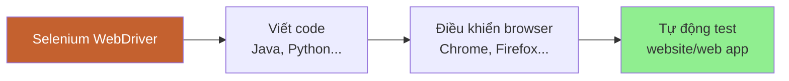
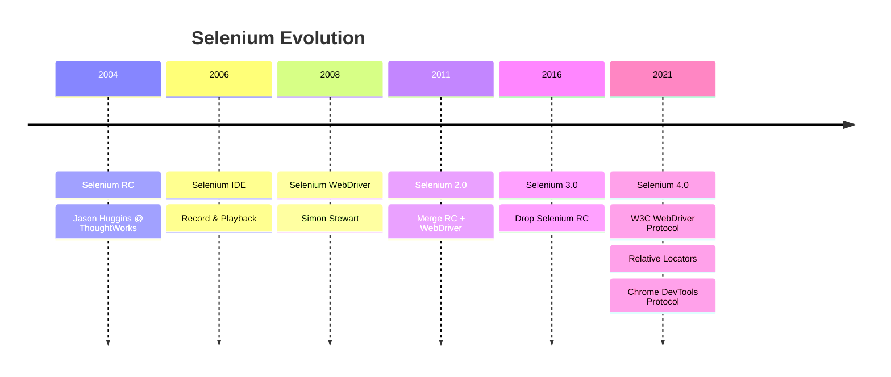
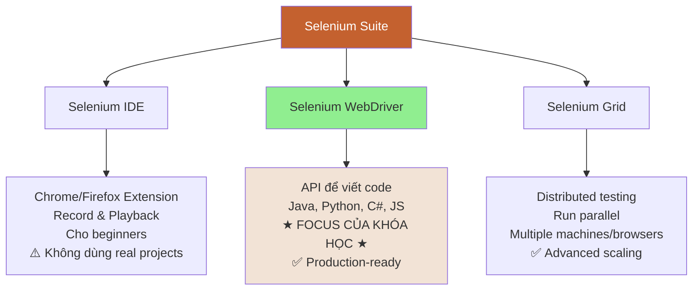
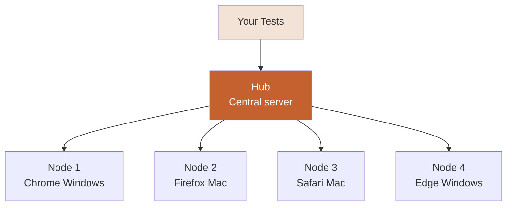
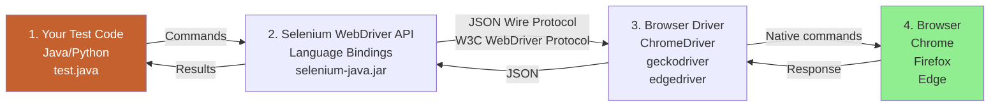
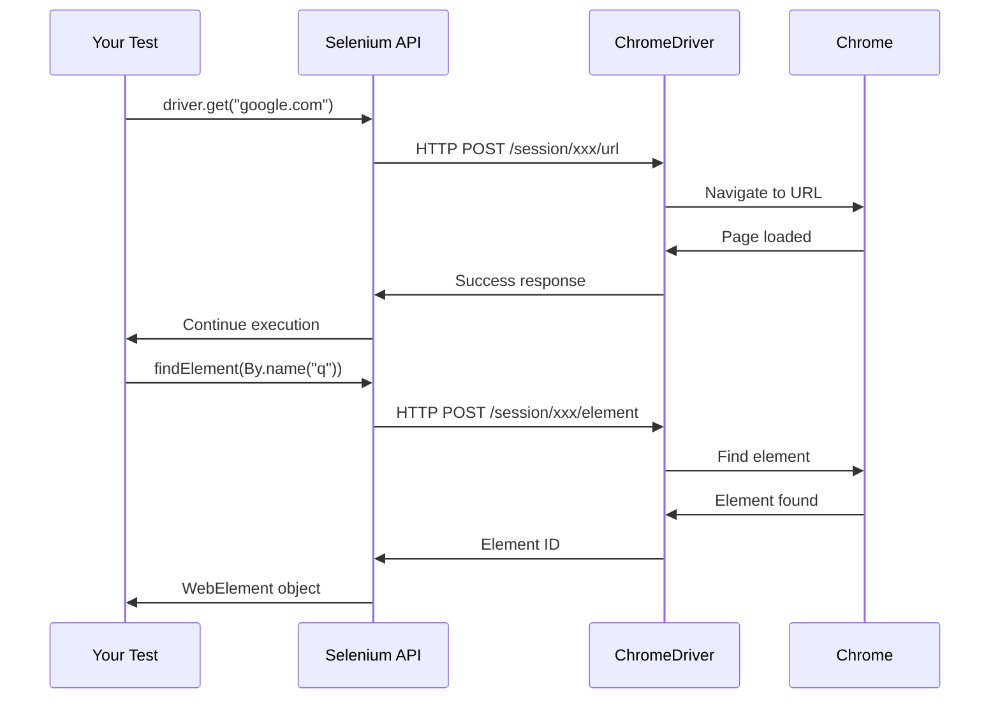
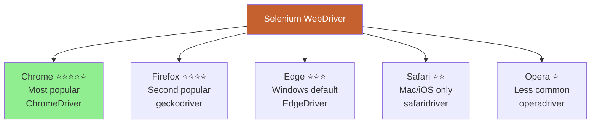
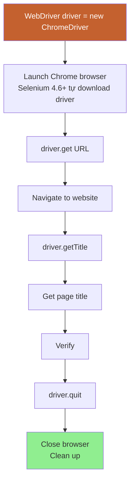
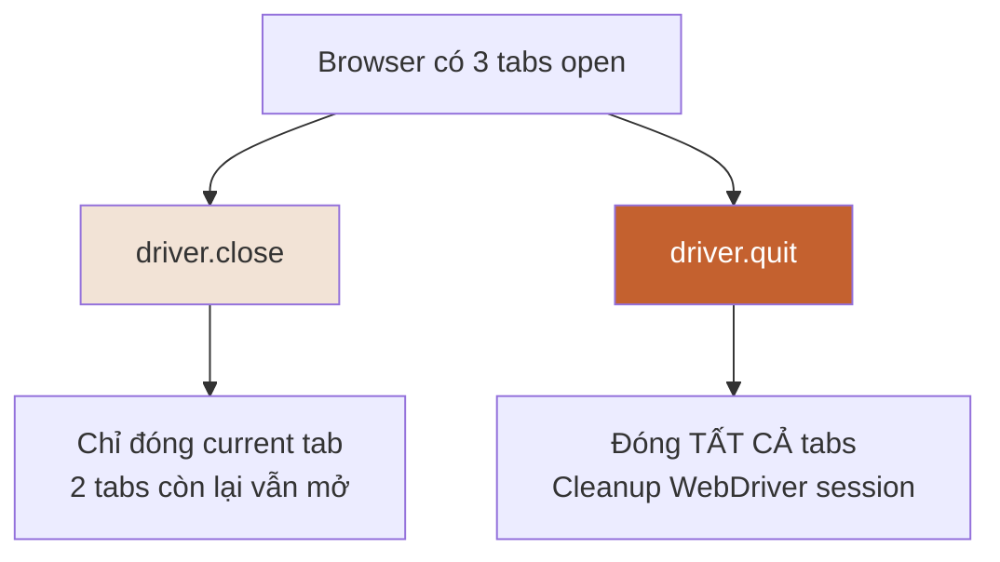

# 🌐 PHẦN 4: SELENIUM INTRODUCTION & SETUP

> **Mục tiêu**: Hiểu Selenium là gì, kiến trúc hoạt động, và viết first test với Selenium WebDriver.

---

## 📑 MỤC LỤC

1. [Selenium là gì?](#selenium-là-gì)
2. [Selenium Suite](#selenium-suite)
3. [WebDriver Architecture](#webdriver-architecture)
4. [Supported Browsers & Languages](#supported-browsers--languages)
5. [Setup Selenium Project](#setup-selenium-project)
6. [First Selenium Test](#first-selenium-test)
7. [WebDriver Basics](#webdriver-basics)

---

## 🎯 Selenium là gì?

> **Selenium** = Open-source tool để **automate web browsers**

### Định nghĩa



**Đơn giản**:
- Bạn viết code (Java)
- Selenium điều khiển browser như một user thật
- Test tự động chạy

---

### Lịch sử Selenium



---

### Tại sao chọn Selenium?

| Feature | Selenium | Playwright | Cypress |
|---------|----------|------------|---------|
| **Open Source** | ✅ Free | ✅ Free | ✅ Free |
| **Languages** | Java, Python, C#, JS, Ruby | JS, Python, Java, C# | JS only |
| **Browsers** | Chrome, Firefox, Safari, Edge, Opera | Chrome, Firefox, Safari, Edge | Chrome, Firefox, Edge |
| **Mobile** | ✅ (với Appium) | ✅ Limited | ❌ |
| **Community** | ⭐⭐⭐⭐⭐ Huge | ⭐⭐⭐ Growing | ⭐⭐⭐⭐ Strong |
| **Jobs** | ⭐⭐⭐⭐⭐ Most | ⭐⭐ Few | ⭐⭐⭐ Medium |
| **Learning Curve** | Medium | Easy | Easy |
| **Speed** | Medium | Fast | Fast |

> 💡 **Recommend Selenium** vì: Nhiều jobs nhất, community lớn nhất, support nhiều languages

---

## 🔧 Selenium Suite

> **Selenium Suite** = Bộ tools của Selenium



---

### 1. Selenium IDE

**Là gì?**
- Browser extension (Chrome/Firefox)
- Record & Playback
- No coding required

**Use case**:
- ✅ Quick prototyping
- ✅ Learning locators
- ❌ KHÔNG dùng cho production

**Demo**:
```
1. Install Selenium IDE extension
2. Click "Record"
3. Thao tác trên website (click, type...)
4. Click "Stop"
5. Playback → Test chạy lại
```

---

### 2. Selenium WebDriver (★ FOCUS)

**Là gì?**
- API để viết automation code
- Support nhiều languages
- Production-ready

**Use case**:
- ✅ Real automation frameworks
- ✅ CI/CD integration
- ✅ Professional testing

---

### 3. Selenium Grid

**Là gì?**
- Distributed testing infrastructure
- Run tests parallel trên nhiều machines
- Support cross-browser testing

**Architecture**:


**Use case**:
- ✅ Run 100 tests in 10 phút thay vì 100 phút
- ✅ Cross-browser testing
- ⚠️ Advanced topic (học sau)

---

## 🏗️ WebDriver Architecture

> **WebDriver** = API để communicate giữa code và browser

### Kiến trúc hoạt động



---

### Chi tiết từng thành phần

#### 1. Test Code (Your Code)

```java
// Bạn viết code
WebDriver driver = new ChromeDriver();
driver.get("https://www.google.com");
driver.findElement(By.name("q")).sendKeys("Selenium");
```

---

#### 2. Selenium WebDriver API

- Language bindings (Java, Python, C#...)
- Convert code thành commands
- Library: `selenium-java.jar`

---

#### 3. Browser Driver

| Browser | Driver | Download (Selenium 4.6+ tự động) |
|---------|--------|----------------------------------|
| Chrome | ChromeDriver | ✅ Auto |
| Firefox | geckodriver | ✅ Auto |
| Edge | EdgeDriver | ✅ Auto |
| Safari | safaridriver | ✅ Built-in macOS |

**Chức năng**:
- Nhận commands từ Selenium API
- Convert thành browser-specific commands
- Control browser thực sự

---

#### 4. Browser

- Chrome, Firefox, Edge, Safari...
- Execute commands
- Return results

---

### Flow Example



---

## 🌐 Supported Browsers & Languages

### Supported Browsers



---

### Supported Languages

| Language | Popularity | Pros | Cons |
|----------|------------|------|------|
| **Java** | ⭐⭐⭐⭐⭐ | Most jobs, enterprise, nhiều frameworks | Verbose syntax |
| **Python** | ⭐⭐⭐⭐ | Dễ học, syntax ngắn gọn | Ít jobs hơn Java |
| **C#** | ⭐⭐⭐ | .NET ecosystem | Ít jobs (chỉ .NET shops) |
| **JavaScript** | ⭐⭐⭐ | Frontend devs familiar | Node.js environment |
| **Ruby** | ⭐⭐ | Clean syntax | Ít dùng, ít jobs |

> 💡 **Khóa này dùng Java** vì nhiều job opportunities nhất!

---

## 🚀 Setup Selenium Project

### Step-by-Step Setup

#### Step 1: Tạo Maven Project

**IntelliJ IDEA**:
```
File → New → Project
→ Maven
→ Name: selenium-demo
→ Create
```

---

#### Step 2: Update pom.xml

```xml
<?xml version="1.0" encoding="UTF-8"?>
<project xmlns="http://maven.apache.org/POM/4.0.0"
         xmlns:xsi="http://www.w3.org/2001/XMLSchema-instance"
         xsi:schemaLocation="http://maven.apache.org/POM/4.0.0 
         http://maven.apache.org/xsd/maven-4.0.0.xsd">
    
    <modelVersion>4.0.0</modelVersion>
    
    <groupId>com.example</groupId>
    <artifactId>selenium-demo</artifactId>
    <version>1.0-SNAPSHOT</version>
    
    <properties>
        <maven.compiler.source>11</maven.compiler.source>
        <maven.compiler.target>11</maven.compiler.target>
        <project.build.sourceEncoding>UTF-8</project.build.sourceEncoding>
        <selenium.version>4.15.0</selenium.version>
    </properties>
    
    <dependencies>
        <!-- Selenium WebDriver -->
        <dependency>
            <groupId>org.seleniumhq.selenium</groupId>
            <artifactId>selenium-java</artifactId>
            <version>${selenium.version}</version>
        </dependency>
    </dependencies>
    
</project>
```

**Save → Maven sẽ tự download dependencies**

---

#### Step 3: Verify Setup

**Check External Libraries trong IntelliJ**:
```
selenium-java-4.15.0.jar
selenium-api-4.15.0.jar
selenium-chrome-driver-4.15.0.jar
selenium-firefox-driver-4.15.0.jar
... (30+ jar files)
```

✅ Nếu thấy → Setup thành công!

---

## ✍️ First Selenium Test

### Test Case: Open Google

```java
package com.example;

import org.openqa.selenium.WebDriver;
import org.openqa.selenium.chrome.ChromeDriver;

public class FirstTest {
    
    public static void main(String[] args) {
        
        // 1. Create WebDriver instance (Launch Chrome)
        WebDriver driver = new ChromeDriver();
        
        // 2. Navigate to URL
        driver.get("https://www.google.com");
        
        // 3. Get page title
        String title = driver.getTitle();
        System.out.println("Page title: " + title);
        
        // 4. Verify title
        if (title.equals("Google")) {
            System.out.println("✅ Test PASSED");
        } else {
            System.out.println("❌ Test FAILED");
        }
        
        // 5. Close browser
        driver.quit();
    }
}
```

---

### Run Test

**IntelliJ**:
```
Right-click on FirstTest.java
→ Run 'FirstTest.main()'
```

**Output**:
```
Starting ChromeDriver...
ChromeDriver started successfully
Page title: Google
✅ Test PASSED
```

**Browser**:
- Chrome tự động mở
- Navigate to google.com
- Tự động đóng

---

### Code Explanation



---

## 🔧 WebDriver Basics

### 1. WebDriver Interface

```java
// WebDriver = Interface
WebDriver driver;

// Implementations (classes)
driver = new ChromeDriver();   // Chrome
driver = new FirefoxDriver();  // Firefox
driver = new EdgeDriver();     // Edge
driver = new SafariDriver();   // Safari
```

---

### 2. Launch Browser

```java
// Chrome
WebDriver driver = new ChromeDriver();

// Firefox
WebDriver driver = new FirefoxDriver();

// Edge
WebDriver driver = new EdgeDriver();

// Safari (Mac only)
WebDriver driver = new SafariDriver();
```

---

### 3. Navigate

```java
// Cách 1: driver.get()
driver.get("https://www.google.com");

// Cách 2: driver.navigate()
driver.navigate().to("https://www.google.com");

// Difference:
// - get(): Chờ page load xong mới return
// - navigate().to(): Không chờ (dùng cho dynamic pages)
```

---

### 4. Navigation Methods

```java
// Forward, Back, Refresh
driver.navigate().back();      // Quay lại trang trước
driver.navigate().forward();   // Tiến tới trang sau
driver.navigate().refresh();   // Refresh page
```

---

### 5. Get Page Information

```java
// Title
String title = driver.getTitle();
System.out.println("Title: " + title);

// Current URL
String url = driver.getCurrentUrl();
System.out.println("URL: " + url);

// Page Source (HTML)
String html = driver.getPageSource();
System.out.println("HTML length: " + html.length());
```

---

### 6. Window Management

```java
// Maximize window
driver.manage().window().maximize();

// Fullscreen
driver.manage().window().fullscreen();

// Set size
Dimension size = new Dimension(1920, 1080);
driver.manage().window().setSize(size);

// Get size
Dimension currentSize = driver.manage().window().getSize();
System.out.println("Width: " + currentSize.getWidth());
System.out.println("Height: " + currentSize.getHeight());

// Set position
Point position = new Point(0, 0);
driver.manage().window().setPosition(position);
```

---

### 7. Close vs Quit

```java
// close() - Đóng current window/tab
driver.close();

// quit() - Đóng tất cả windows + cleanup session
driver.quit();
```

**Khác biệt**:



> ⚠️ **Best Practice**: Luôn dùng `quit()` để cleanup resources!

---

### 8. Complete Example

```java
package com.example;

import org.openqa.selenium.WebDriver;
import org.openqa.selenium.chrome.ChromeDriver;
import org.openqa.selenium.Dimension;

public class WebDriverBasics {
    
    public static void main(String[] args) {
        
        // Launch browser
        WebDriver driver = new ChromeDriver();
        
        try {
            // Maximize window
            driver.manage().window().maximize();
            
            // Navigate
            driver.get("https://www.selenium.dev");
            
            // Get info
            System.out.println("Title: " + driver.getTitle());
            System.out.println("URL: " + driver.getCurrentUrl());
            
            Dimension size = driver.manage().window().getSize();
            System.out.println("Window size: " + size.getWidth() + "x" + size.getHeight());
            
            // Navigate
            driver.navigate().to("https://www.google.com");
            System.out.println("Navigated to: " + driver.getCurrentUrl());
            
            // Back
            driver.navigate().back();
            System.out.println("Back to: " + driver.getCurrentUrl());
            
            // Forward
            driver.navigate().forward();
            System.out.println("Forward to: " + driver.getCurrentUrl());
            
            // Refresh
            driver.navigate().refresh();
            System.out.println("Page refreshed");
            
        } finally {
            // Always cleanup
            driver.quit();
        }
    }
}
```

---

## 🎨 Headless Mode

> **Headless** = Chạy browser không hiển thị UI (background)

### Khi nào dùng?

✅ **CI/CD pipelines** (Jenkins, GitHub Actions)  
✅ **Server không có GUI**  
✅ **Chạy nhanh hơn** (không render UI)  

---

### Chrome Headless

```java
import org.openqa.selenium.WebDriver;
import org.openqa.selenium.chrome.ChromeDriver;
import org.openqa.selenium.chrome.ChromeOptions;

public class HeadlessDemo {
    public static void main(String[] args) {
        
        // Chrome Options
        ChromeOptions options = new ChromeOptions();
        options.addArguments("--headless");
        options.addArguments("--disable-gpu");
        options.addArguments("--window-size=1920,1080");
        
        // Launch Chrome in headless mode
        WebDriver driver = new ChromeDriver(options);
        
        driver.get("https://www.google.com");
        System.out.println("Title: " + driver.getTitle());
        
        driver.quit();
    }
}
```

---

## ✅ TÓM TẮT BÀI HỌC

📌 **Selenium** = Open-source tool để automate browsers  
📌 **Selenium Suite**: IDE (record), WebDriver (code), Grid (parallel)  
📌 **Architecture**: Test Code → Selenium API → Browser Driver → Browser  
📌 **Setup**: Maven project + selenium-java dependency  
📌 **First Test**: `new ChromeDriver()` → `get()` → `quit()`  
📌 **Basics**: Navigate, get title/URL, maximize, close vs quit  

---

## 🎯 SAU KHI HỌC BUỔI NÀY

### Checklist

- [ ] Hiểu Selenium architecture
- [ ] Setup Maven project với Selenium
- [ ] Viết và chạy được first test
- [ ] Hiểu các WebDriver basic methods

### 📝 Thực hành

**Bài 1: First Test**
```java
// Tạo test:
// 1. Launch Chrome
// 2. Navigate to https://www.selenium.dev
// 3. Print title
// 4. Verify title contains "Selenium"
// 5. Quit
```

**Bài 2: Navigation**
```java
// 1. Go to google.com
// 2. Navigate to facebook.com
// 3. Back to google.com
// 4. Forward to facebook.com
// 5. Refresh
```

**Bài 3: Window Management**
```java
// 1. Launch browser
// 2. Maximize window
// 3. Print window size
// 4. Set size to 1024x768
// 5. Set position to (100, 100)
```

---

[← Bài trước: Maven](03-maven-build-tool.md) | [Bài tiếp: Locators →](05-locators-8-strategies.md)

---

**Happy Automation!** 🌐  
*"The first step in automation is always the hardest. The second step is finding the right locator."*
