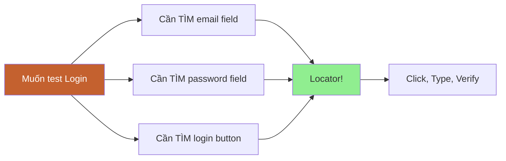
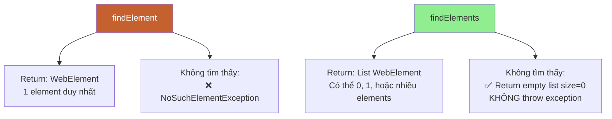
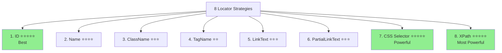
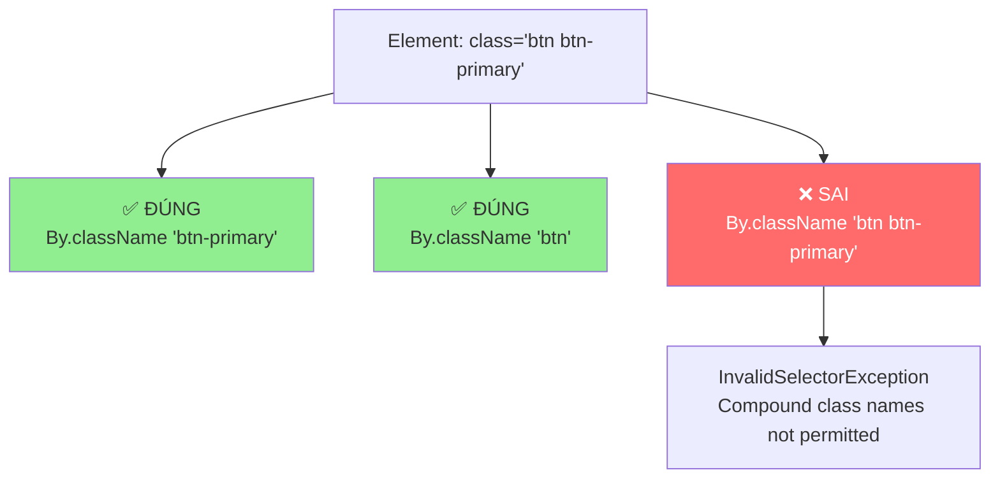
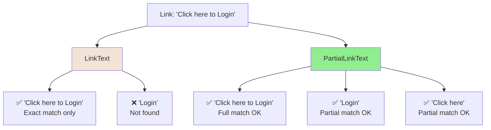
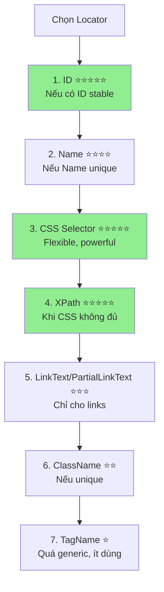

# 🎯 PHẦN 5: LOCATORS - 8 STRATEGIES

> **Mục tiêu**: Nắm vững 8 loại locators để tìm elements trên web page - kỹ năng quan trọng nhất trong Selenium!

---

## 📑 MỤC LỤC

1. [Locators là gì?](#locators-là-gì)
2. [findElement vs findElements](#findelement-vs-findelements)
3. [8 Locator Strategies](#8-locator-strategies)
4. [Locator Priority](#locator-priority)
5. [Best Practices](#best-practices)
6. [Common Mistakes](#common-mistakes)

---

## 🎯 Locators là gì?

> **Locator** = Cách để **tìm elements** trên web page để thao tác (click, type, verify...)

### Tại sao quan trọng?



**Không có locator → Không thể automation!**

---

### Analogy

```
Web Page = Thành phố
Element = Ngôi nhà cụ thể
Locator = Địa chỉ để tìm nhà đó

Ví dụ:
- ID = Số nhà duy nhất (123 Đường ABC)
- Name = Tên chủ nhà
- Class = Khu vực (Quận 1, Phường 2)
- XPath = Hướng dẫn đường đi chi tiết
```

---

## 🔍 findElement vs findElements

### Syntax

```java
// findElement - Tìm 1 element (đầu tiên match)
WebElement element = driver.findElement(By.id("email"));

// findElements - Tìm TẤT CẢ elements match
List<WebElement> elements = driver.findElements(By.tagName("a"));
```

---

### Khác biệt quan trọng



---

### Example

```java
// findElement
WebElement emailField = driver.findElement(By.id("email"));
// Nếu không tìm thấy → NoSuchElementException

// findElements
List<WebElement> links = driver.findElements(By.tagName("a"));
System.out.println("Total links: " + links.size());
// Nếu không tìm thấy → size = 0 (không throw exception)

// Check trước khi dùng
if (!links.isEmpty()) {
    links.get(0).click();
}
```

---

## 🎯 8 Locator Strategies

### Overview



---

## 1️⃣ ID Locator

> **ID** = Unique identifier của element (như CMND của người)

### HTML Example

```html
<input type="text" id="email" name="user_email" placeholder="Email">
<input type="password" id="password" name="user_password">
<button id="loginBtn">Login</button>
```

---

### Selenium Code

```java
// By.id()
WebElement emailField = driver.findElement(By.id("email"));
emailField.sendKeys("test@example.com");

WebElement passwordField = driver.findElement(By.id("password"));
passwordField.sendKeys("Test@123");

WebElement loginButton = driver.findElement(By.id("loginBtn"));
loginButton.click();
```

---

### Ưu và Nhược điểm

| Ưu điểm ✅ | Nhược điểm ❌ |
|-----------|--------------|
| **Nhanh nhất** (browser optimize) | Không phải element nào cũng có ID |
| **Unique** (theo chuẩn HTML) | Một số site generate random IDs |
| **Dễ đọc, dễ maintain** | Dynamic IDs (`user_12345`) |
| **Stable** (ít thay đổi) | |

---

### Best for

✅ Elements có ID stable  
✅ Priority #1 nếu có ID  

---

## 2️⃣ Name Locator

> **Name** = Attribute name của element (thường dùng cho form inputs)

### HTML Example

```html
<input type="text" name="username">
<input type="password" name="password">
<input type="email" name="email">
<select name="country">
    <option>Vietnam</option>
    <option>USA</option>
</select>
```

---

### Selenium Code

```java
// By.name()
WebElement usernameField = driver.findElement(By.name("username"));
usernameField.sendKeys("testuser");

WebElement emailField = driver.findElement(By.name("email"));
emailField.sendKeys("test@example.com");

WebElement countryDropdown = driver.findElement(By.name("country"));
```

---

### Lưu ý

⚠️ **Name có thể duplicate** (nhiều elements cùng name)

```html
<!-- Multiple radio buttons cùng name -->
<input type="radio" name="gender" value="male"> Male
<input type="radio" name="gender" value="female"> Female
```

```java
// findElement → Lấy element ĐẦU TIÊN match
WebElement firstGender = driver.findElement(By.name("gender"));

// findElements → Lấy TẤT CẢ
List<WebElement> allGenders = driver.findElements(By.name("gender"));
System.out.println("Total: " + allGenders.size()); // 2
```

---

## 3️⃣ ClassName Locator

> **ClassName** = CSS class của element

### HTML Example

```html
<button class="btn btn-primary">Login</button>
<button class="btn btn-secondary">Cancel</button>
<p class="error-message">Invalid credentials</p>
```

---

### Selenium Code

```java
// By.className()
// ⚠️ CHỈ dùng 1 class name (không có space!)

// ✅ ĐÚNG
WebElement loginBtn = driver.findElement(By.className("btn-primary"));

WebElement errorMsg = driver.findElement(By.className("error-message"));

// ❌ SAI - Không dùng multiple classes
// driver.findElement(By.className("btn btn-primary")); // WRONG!
```

---

### Lưu ý quan trọng



---

### Use case

```java
// Find tất cả elements có cùng class
List<WebElement> allButtons = driver.findElements(By.className("btn"));
System.out.println("Total buttons: " + allButtons.size());

// Find error messages
List<WebElement> errors = driver.findElements(By.className("error-message"));
if (!errors.isEmpty()) {
    System.out.println("Error: " + errors.get(0).getText());
}
```

---

## 4️⃣ TagName Locator

> **TagName** = HTML tag của element (div, input, button, a, img...)

### HTML Example

```html
<h1>Welcome to Selenium</h1>
<p>This is a paragraph</p>
<a href="/login">Login</a>
<a href="/register">Register</a>

```

---

### Selenium Code

```java
// By.tagName()

// Find heading
WebElement heading = driver.findElement(By.tagName("h1"));
System.out.println("Heading: " + heading.getText());

// Find tất cả links
List<WebElement> links = driver.findElements(By.tagName("a"));
System.out.println("Total links: " + links.size());

for (WebElement link : links) {
    System.out.println("Link text: " + link.getText());
    System.out.println("Link href: " + link.getAttribute("href"));
}

// Find tất cả images
List<WebElement> images = driver.findElements(By.tagName("img"));
System.out.println("Total images: " + images.size());
```

---

### Use case

✅ **Count elements**: Đếm bao nhiêu links, images, buttons...  
✅ **Loop qua elements**: Get all links, all images...  
❌ **Locate specific element**: Quá generic (nhiều elements cùng tag)  

---

### Example: Get all links on page

```java
public class GetAllLinks {
    public static void main(String[] args) {
        WebDriver driver = new ChromeDriver();
        driver.get("https://www.google.com");
        
        // Find tất cả <a> tags
        List<WebElement> links = driver.findElements(By.tagName("a"));
        
        System.out.println("Total links: " + links.size());
        
        // Print all links
        for (WebElement link : links) {
            String href = link.getAttribute("href");
            String text = link.getText();
            
            if (href != null && !href.isEmpty()) {
                System.out.println("Text: " + text + " | Href: " + href);
            }
        }
        
        driver.quit();
    }
}
```

---

## 5️⃣ LinkText Locator

> **LinkText** = Text hiển thị của link (chỉ dùng cho `<a>` tag)

### HTML Example

```html
<a href="/login">Login Here</a>
<a href="/register">Register Now</a>
<a href="/forgot-password">Forgot Password?</a>
```

---

### Selenium Code

```java
// By.linkText() - Text phải khớp CHÍNH XÁC (exact match)

WebElement loginLink = driver.findElement(By.linkText("Login Here"));
loginLink.click();

WebElement registerLink = driver.findElement(By.linkText("Register Now"));
registerLink.click();

WebElement forgotLink = driver.findElement(By.linkText("Forgot Password?"));
forgotLink.click();
```

---

### Lưu ý

⚠️ **Case-sensitive** (phân biệt hoa thường)

```java
// ✅ ĐÚNG
driver.findElement(By.linkText("Login Here"));

// ❌ SAI - Sai case
driver.findElement(By.linkText("login here")); // NoSuchElementException

// ❌ SAI - Thiếu từ
driver.findElement(By.linkText("Login")); // NoSuchElementException
```

---

⚠️ **Exact match** (phải khớp toàn bộ text)

```html
<a href="/login">Click here to Login</a>
```

```java
// ✅ ĐÚNG
driver.findElement(By.linkText("Click here to Login"));

// ❌ SAI - Chỉ một phần text
driver.findElement(By.linkText("Login")); // NoSuchElementException
```

---

## 6️⃣ PartialLinkText Locator

> **PartialLinkText** = Một phần text của link (không cần exact match)

### HTML Example

```html
<a href="/login">Click here to Login to your account</a>
<a href="/register">Register Now and get started</a>
```

---

### Selenium Code

```java
// By.partialLinkText() - Chỉ cần một phần text

// Full text
driver.findElement(By.linkText("Click here to Login to your account"));

// Partial text (dễ hơn!)
driver.findElement(By.partialLinkText("Login"));
driver.findElement(By.partialLinkText("Click here"));
driver.findElement(By.partialLinkText("to Login"));

// Register
driver.findElement(By.partialLinkText("Register"));
driver.findElement(By.partialLinkText("get started"));
```

---

### LinkText vs PartialLinkText



---

### Use case

✅ **Long link text**: Dùng partial thay vì full text  
✅ **Dynamic text**: Text có thể thay đổi một phần  
⚠️ **Unique partial**: Đảm bảo partial text unique trên page  

---

## 7️⃣ CSS Selector Locator

> **CSS Selector** = Powerful locator dùng CSS syntax (học chi tiết ở Phần 6)

### Basic Syntax Preview

```java
// Tag
driver.findElement(By.cssSelector("input"));

// ID: #id
driver.findElement(By.cssSelector("#email"));
driver.findElement(By.cssSelector("input#email"));

// Class: .class
driver.findElement(By.cssSelector(".btn-primary"));
driver.findElement(By.cssSelector("button.btn-primary"));

// Attribute: [attribute='value']
driver.findElement(By.cssSelector("input[name='email']"));
driver.findElement(By.cssSelector("input[type='password']"));

// Multiple attributes
driver.findElement(By.cssSelector("input[type='text'][name='email']"));

// Contains: [attribute*='value']
driver.findElement(By.cssSelector("a[href*='login']"));
```

> 💡 **Sẽ học chi tiết ở Phần 6: CSS Selector Deep Dive**

---

## 8️⃣ XPath Locator

> **XPath** = Most powerful locator, có thể locate BẤT KỲ element nào (học chi tiết ở Phần 7)

### Basic Syntax Preview

```java
// Absolute XPath (❌ BAD - dễ break)
driver.findElement(By.xpath("/html/body/div[1]/form/input[1]"));

// Relative XPath (✅ GOOD)
driver.findElement(By.xpath("//input[@id='email']"));
driver.findElement(By.xpath("//input[@name='email']"));

// Text-based
driver.findElement(By.xpath("//button[text()='Login']"));
driver.findElement(By.xpath("//a[contains(text(),'Login')]"));

// Parent-child
driver.findElement(By.xpath("//div[@id='loginForm']//input[@name='email']"));

// Following-sibling
driver.findElement(By.xpath("//label[text()='Email']/following-sibling::input"));
```

> 💡 **Sẽ học chi tiết ở Phần 7: XPath Deep Dive**

---

## 📊 Locator Priority - Best Practices

### Priority Order



---

### Comparison Table

| Locator | Speed | Reliability | Flexibility | Readability | Recommend |
|---------|-------|-------------|-------------|-------------|-----------|
| **ID** | ⚡⚡⚡⚡⚡ | ⭐⭐⭐⭐⭐ | ⭐⭐ | ⭐⭐⭐⭐⭐ | ✅ Best |
| **Name** | ⚡⚡⚡⚡⚡ | ⭐⭐⭐⭐ | ⭐⭐ | ⭐⭐⭐⭐⭐ | ✅ Good |
| **CSS** | ⚡⚡⚡⚡ | ⭐⭐⭐⭐ | ⭐⭐⭐⭐⭐ | ⭐⭐⭐⭐ | ✅ Recommend |
| **XPath** | ⚡⚡⚡ | ⭐⭐⭐⭐ | ⭐⭐⭐⭐⭐ | ⭐⭐⭐ | ✅ Powerful |
| **LinkText** | ⚡⚡⚡⚡ | ⭐⭐⭐ | ⭐⭐ | ⭐⭐⭐⭐⭐ | ⚠️ Links only |
| **ClassName** | ⚡⚡⚡⚡ | ⭐⭐ | ⭐⭐ | ⭐⭐⭐ | ⚠️ If unique |
| **TagName** | ⚡⚡⚡⚡⚡ | ⭐ | ⭐ | ⭐⭐⭐ | ❌ Too generic |

---

### Golden Rule

> **"Use the most SIMPLE, STABLE, and READABLE locator"**

#### Examples

```html
<!-- Element 1 -->
<input type="text" id="email" name="user_email" class="form-control">
```

```java
// ✅ BEST - ID (simple, stable)
driver.findElement(By.id("email"));

// ⚠️ OK nhưng không cần thiết
driver.findElement(By.name("user_email"));
driver.findElement(By.cssSelector("#email"));
driver.findElement(By.xpath("//input[@id='email']"));
```

---

```html
<!-- Element 2 - Không có ID -->
<button class="btn btn-primary submit-button">Login</button>
```

```java
// ✅ GOOD - CSS with class
driver.findElement(By.cssSelector(".submit-button"));

// ✅ GOOD - XPath with text
driver.findElement(By.xpath("//button[text()='Login']"));

// ⚠️ Less stable
driver.findElement(By.className("submit-button"));
```

---

## ❌ Common Mistakes

### 1. Dùng Absolute XPath

```java
// ❌ SAI - Absolute XPath (dễ break)
driver.findElement(By.xpath("/html/body/div[1]/div[2]/form/input[1]"));

// ✅ ĐÚNG - Relative XPath
driver.findElement(By.xpath("//input[@id='email']"));
```

---

### 2. Dùng Multiple Classes trong className

```java
// ❌ SAI
driver.findElement(By.className("btn btn-primary"));
// InvalidSelectorException!

// ✅ ĐÚNG - Chỉ 1 class
driver.findElement(By.className("btn-primary"));

// ✅ HOẶC dùng CSS
driver.findElement(By.cssSelector(".btn.btn-primary"));
```

---

### 3. Không check element exists

```java
// ❌ SAI - Crash nếu không tìm thấy
WebElement element = driver.findElement(By.id("nonexistent"));
element.click(); // NoSuchElementException!

// ✅ ĐÚNG - Check trước
try {
    WebElement element = driver.findElement(By.id("email"));
    element.click();
} catch (NoSuchElementException e) {
    System.out.println("Element không tìm thấy");
}

// ✅ HOẶC dùng findElements
List<WebElement> elements = driver.findElements(By.id("email"));
if (!elements.isEmpty()) {
    elements.get(0).click();
}
```

---

### 4. Case-sensitive issues

```html
<a href="/login">Login</a>
```

```java
// ❌ SAI - Sai case
driver.findElement(By.linkText("login")); // NoSuchElementException

// ✅ ĐÚNG
driver.findElement(By.linkText("Login"));
```

---

## ✅ TÓM TẮT BÀI HỌC

📌 **Locator** = Cách tìm elements trên page  
📌 **findElement** = 1 element, throw exception nếu không có  
📌 **findElements** = List, return empty nếu không có  
📌 **8 locators**: ID, Name, ClassName, TagName, LinkText, PartialLinkText, CSS, XPath  
📌 **Priority**: ID > Name > CSS > XPath  
📌 **Best practice**: Simple, Stable, Readable  

---

## 🎯 SAU KHI HỌC BUỔI NÀY

### Checklist

- [ ] Hiểu rõ 8 loại locators
- [ ] Biết khi nào dùng locator nào
- [ ] Biết findElement vs findElements
- [ ] Tránh được common mistakes

### 📝 Thực hành

**Bài 1: Locate Elements**

Đi đến https://demo.opencart.com và tìm các elements:

```java
// 1. Search box (dùng name)
// 2. Search button (dùng CSS)
// 3. "My Account" link (dùng linkText)
// 4. Logo image (dùng tagName)
// 5. Login link (dùng partialLinkText)
```

**Bài 2: Count Elements**

```java
// Đếm:
// 1. Tổng số links trên page
// 2. Tổng số images
// 3. Tổng số buttons
```

**Bài 3: Multiple Locators**

Với element sau, viết 3 cách locate khác nhau:
```html
<input type="text" id="email" name="user_email" class="form-control">
```

```java
// Cách 1: By.id
// Cách 2: By.name
// Cách 3: By.cssSelector
```

---

[← Bài trước: Selenium Introduction](04-selenium-introduction.md) | [Bài tiếp: CSS Selector Deep Dive →](06-css-selector-deep-dive.md)

---

**Happy Locating!** 🎯  
*"90% of Selenium is about finding the right locator. The other 10% is clicking it."*
