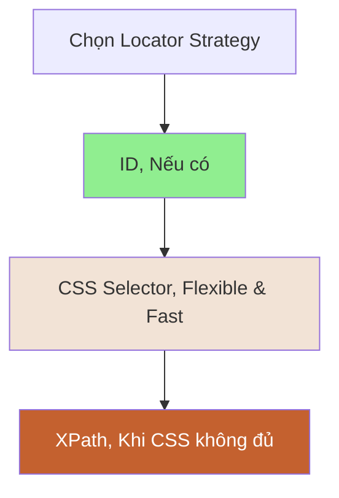
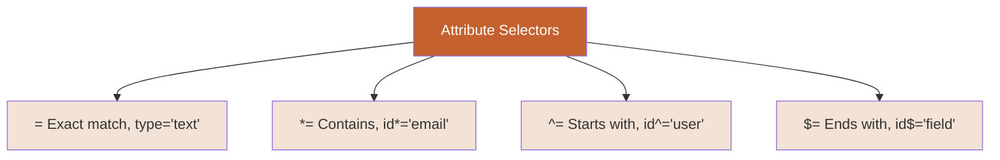
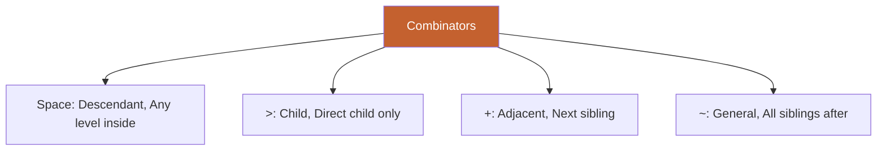

# 🎨 PHẦN 6: CSS SELECTOR DEEP DIVE

> **Mục tiêu**: Thành thạo CSS Selector - một trong những locator strategies mạnh mẽ và phổ biến nhất trong Selenium.

---

## 📑 MỤC LỤC

1. [Tại sao học CSS Selector?](#tại-sao-học-css-selector)
2. [Basic CSS Selectors](#basic-css-selectors)
3. [Attribute Selectors](#attribute-selectors)
4. [Combinators](#combinators)
5. [Pseudo-classes](#pseudo-classes)
6. [CSS vs XPath](#css-vs-xpath)
7. [Real-world Examples](#real-world-examples)
8. [Best Practices](#best-practices)

---

## 🎯 Tại sao học CSS Selector?

### So sánh CSS vs XPath vs ID



---

### Ưu điểm của CSS Selector

| Đặc điểm | CSS Selector | XPath |
|----------|--------------|-------|
| **Tốc độ** | ⚡⚡⚡⚡⚡ Nhanh hơn | ⚡⚡⚡ Chậm hơn |
| **Browser native** | ✅ Yes | ❌ No (engine riêng) |
| **Syntax** | Ngắn gọn, dễ đọc | Dài hơn |
| **Learning curve** | Dễ học | Khó hơn |
| **Coverage** | 80% use cases | 100% (powerful hơn) |
| **Interview** | ⭐⭐⭐⭐⭐ Hay hỏi | ⭐⭐⭐⭐ Hay hỏi |

> 💡 **Recommend**: Học CSS trước, XPath sau!

---

## 🔤 Basic CSS Selectors

### 1. Tag Selector

**Syntax**: `tag`

```html
<input type="text">
<button>Click me</button>
<a href="/login">Login</a>
```

```java
// Select by tag
driver.findElement(By.cssSelector("input"));
driver.findElement(By.cssSelector("button"));
driver.findElement(By.cssSelector("a"));

// Find all tags
List<WebElement> allInputs = driver.findElements(By.cssSelector("input"));
List<WebElement> allButtons = driver.findElements(By.cssSelector("button"));
```

---

### 2. ID Selector

**Syntax**: `#id` hoặc `tag#id`

```html
<input type="text" id="email">
<input type="password" id="password">
<button id="loginBtn">Login</button>
```

```java
// #id
driver.findElement(By.cssSelector("#email"));
driver.findElement(By.cssSelector("#password"));
driver.findElement(By.cssSelector("#loginBtn"));

// tag#id (more specific)
driver.findElement(By.cssSelector("input#email"));
driver.findElement(By.cssSelector("button#loginBtn"));
```

**Lưu ý**: `#` = ID selector (giống CSS thật)

---

### 3. Class Selector

**Syntax**: `.class` hoặc `tag.class`

```html
<button class="btn">Cancel</button>
<button class="btn-primary">Login</button>
<div class="error-message">Invalid email</div>
```

```java
// .class
driver.findElement(By.cssSelector(".btn"));
driver.findElement(By.cssSelector(".btn-primary"));
driver.findElement(By.cssSelector(".error-message"));

// tag.class (more specific)
driver.findElement(By.cssSelector("button.btn"));
driver.findElement(By.cssSelector("div.error-message"));
```

---

### 4. Multiple Classes

**Syntax**: `.class1.class2.class3` (không có space!)

```html
<button class="btn btn-primary btn-lg">Login</button>
<div class="alert alert-danger">Error!</div>
```

```java
// Multiple classes (NO SPACE between classes)
driver.findElement(By.cssSelector(".btn.btn-primary"));
driver.findElement(By.cssSelector(".btn.btn-primary.btn-lg"));
driver.findElement(By.cssSelector(".alert.alert-danger"));

// With tag
driver.findElement(By.cssSelector("button.btn.btn-primary"));
```

**So sánh**:

```java
// ✅ ĐÚNG - No space (element có CẢ 2 classes)
.btn.btn-primary     → element với class="btn btn-primary"

// ❌ SAI - Có space (descendant selector)
.btn .btn-primary    → .btn-primary BÊN TRONG .btn (khác meaning!)
```

---

### 5. Universal Selector

**Syntax**: `*`

```java
// Select TẤT CẢ elements
List<WebElement> allElements = driver.findElements(By.cssSelector("*"));

// Ít dùng trong automation (quá generic)
```

---

## 🏷️ Attribute Selectors

### 1. Exact Match: [attribute='value']

```html
<input type="text" name="email">
<input type="password" name="password">
<button type="submit">Login</button>
```

```java
// [attribute='value']
driver.findElement(By.cssSelector("input[type='text']"));
driver.findElement(By.cssSelector("input[name='email']"));
driver.findElement(By.cssSelector("button[type='submit']"));

// Multiple attributes
driver.findElement(By.cssSelector("input[type='text'][name='email']"));
```

---

### 2. Contains: [attribute*='value']

**Syntax**: `*=` (contains substring)

```html
<a href="https://example.com/login">Login</a>
<a href="https://example.com/register">Register</a>
<input id="user-email-field" type="text">
```

```java
// href contains 'login'
driver.findElement(By.cssSelector("a[href*='login']"));

// href contains 'register'
driver.findElement(By.cssSelector("a[href*='register']"));

// id contains 'email'
driver.findElement(By.cssSelector("input[id*='email']"));
```

**Use case**: Dynamic IDs/classes có prefix hoặc suffix

---

### 3. Starts with: [attribute^='value']

**Syntax**: `^=` (starts with)

```html
<input id="email-field-123">
<input id="email-field-456">
<div class="btn-primary">Button</div>
<div class="btn-secondary">Button</div>
```

```java
// id starts with 'email'
driver.findElement(By.cssSelector("input[id^='email']"));

// class starts with 'btn'
driver.findElement(By.cssSelector("div[class^='btn']"));
```

---

### 4. Ends with: [attribute$='value']

**Syntax**: `$=` (ends with)

```html
<input id="user-email">
<input id="admin-email">
<a href="page.html">Link</a>
<a href="page.pdf">PDF</a>
```

```java
// id ends with 'email'
driver.findElement(By.cssSelector("input[id$='email']"));

// href ends with '.pdf'
driver.findElement(By.cssSelector("a[href$='.pdf']"));
```

---

### Attribute Selectors Summary



---

## 🔗 Combinators

### 1. Descendant: space

**Syntax**: `A B` (B bên trong A, bất kỳ level nào)

```html
<div class="form">
  <div class="input-group">
    <input id="email">
  </div>
</div>
```

```java
// input BÊN TRONG .form (bất kỳ level)
driver.findElement(By.cssSelector(".form input"));

// Tương đương
driver.findElement(By.cssSelector("div.form input"));
```

**Visual**:
```
.form
  └── .input-group
        └── input  ← Match (descendant)
```

---

### 2. Child: >

**Syntax**: `A > B` (B là direct child của A)

```html
<div class="form">
  <input id="email">        <!-- Direct child -->
  <div>
    <input id="password">   <!-- NOT direct child -->
  </div>
</div>
```

```java
// input là DIRECT CHILD của .form
driver.findElement(By.cssSelector(".form > input")); // Chỉ tìm email

// So sánh với descendant
driver.findElements(By.cssSelector(".form input")); // Tìm cả email và password
```

---

### 3. Adjacent Sibling: +

**Syntax**: `A + B` (B ngay sau A, cùng level)

```html
<label>Email</label>
<input id="email">      <!-- Adjacent sibling -->
<input id="password">
```

```java
// input NGAY SAU label
driver.findElement(By.cssSelector("label + input")); // email field
```

**Visual**:
```
label
input  ← Match (adjacent sibling)
input  ← Not match (not adjacent to label)
```

---

### 4. General Sibling: ~

**Syntax**: `A ~ B` (tất cả B sau A, cùng level)

```html
<label>Email</label>
<input id="email">      <!-- Sibling -->
<input id="password">   <!-- Sibling -->
```

```java
// TẤT CẢ input sau label
List<WebElement> inputs = driver.findElements(By.cssSelector("label ~ input"));
// Tìm được cả email và password
```

---

### Combinators Comparison



| Combinator | Meaning | Example |
|------------|---------|---------|
| **space** | Descendant | `.form input` |
| **>** | Direct child | `.form > input` |
| **+** | Next sibling | `label + input` |
| **~** | All siblings | `label ~ input` |

---

## 🎯 Pseudo-classes

### 1. :first-child

```html
<ul>
  <li>Item 1</li>  <!-- first-child -->
  <li>Item 2</li>
  <li>Item 3</li>
</ul>
```

```java
// Li đầu tiên
driver.findElement(By.cssSelector("ul > li:first-child"));
```

---

### 2. :last-child

```java
// Li cuối cùng
driver.findElement(By.cssSelector("ul > li:last-child"));
```

---

### 3. :nth-child(n)

```java
// Li thứ 1
driver.findElement(By.cssSelector("ul > li:nth-child(1)"));

// Li thứ 2
driver.findElement(By.cssSelector("ul > li:nth-child(2)"));

// Li thứ 3
driver.findElement(By.cssSelector("ul > li:nth-child(3)"));
```

**Lưu ý**: Index bắt đầu từ **1** (không phải 0!)

---

### 4. :nth-of-type(n)

```html
<div>
  <p>Paragraph 1</p>
  <span>Span</span>
  <p>Paragraph 2</p>  <!-- 2nd <p> -->
</div>
```

```java
// Paragraph thứ 2
driver.findElement(By.cssSelector("p:nth-of-type(2)"));
```

---

### 5. :not()

```html
<input type="text" name="email">
<input type="password" name="password">
<input type="submit" value="Login">
```

```java
// Tất cả input KHÔNG phải type='submit'
List<WebElement> inputs = driver.findElements(By.cssSelector("input:not([type='submit'])"));
```

---

## 🆚 CSS vs XPath

### Khi nào dùng CSS?

✅ **Locate by ID, class, attributes**  
✅ **Descendant, child relationships**  
✅ **Nth-child selections**  
✅ **Performance matters**  

### Khi nào dùng XPath?

✅ **Locate by text**: `//button[text()='Login']`  
✅ **Parent traversal**: `//input/parent::div`  
✅ **Complex conditions**: `//input[@type='text' and @name='email']`  
✅ **Axes**: following-sibling, preceding, ancestor  

---

### Example So sánh

```html
<div id="loginForm">
  <label>Email</label>
  <input type="text" name="email">
</div>
```

**CSS**:
```java
// By ID
driver.findElement(By.cssSelector("#loginForm"));

// Input inside form
driver.findElement(By.cssSelector("#loginForm input"));

// Input với type='text'
driver.findElement(By.cssSelector("input[type='text'][name='email']"));
```

**XPath**:
```java
// By ID
driver.findElement(By.xpath("//div[@id='loginForm']"));

// Input inside form
driver.findElement(By.xpath("//div[@id='loginForm']//input"));

// Label text + sibling input
driver.findElement(By.xpath("//label[text()='Email']/following-sibling::input"));
```

---

## 💼 Real-world Examples

### Example 1: Login Form

```html
<form id="loginForm" class="auth-form">
  <div class="form-group">
    <label for="email">Email</label>
    <input type="text" id="email" name="user_email" class="form-control">
  </div>
  <div class="form-group">
    <label for="password">Password</label>
    <input type="password" id="password" name="user_password" class="form-control">
  </div>
  <button type="submit" class="btn btn-primary">Login</button>
</form>
```

**Multiple ways**:

```java
// Email field
driver.findElement(By.cssSelector("#email"));
driver.findElement(By.cssSelector("input#email"));
driver.findElement(By.cssSelector("input[name='user_email']"));
driver.findElement(By.cssSelector(".auth-form input[type='text']"));
driver.findElement(By.cssSelector("#loginForm .form-control:first-of-type"));

// Password field
driver.findElement(By.cssSelector("#password"));
driver.findElement(By.cssSelector("input[type='password']"));
driver.findElement(By.cssSelector("input[name='user_password']"));

// Login button
driver.findElement(By.cssSelector("button[type='submit']"));
driver.findElement(By.cssSelector(".btn.btn-primary"));
driver.findElement(By.cssSelector("#loginForm button"));
```

---

### Example 2: Table

```html
<table id="users">
  <tr>
    <td>John</td>
    <td>john@example.com</td>
    <td><button class="btn-edit">Edit</button></td>
  </tr>
  <tr>
    <td>Jane</td>
    <td>jane@example.com</td>
    <td><button class="btn-edit">Edit</button></td>
  </tr>
</table>
```

```java
// First row
driver.findElement(By.cssSelector("#users tr:first-child"));

// Second row
driver.findElement(By.cssSelector("#users tr:nth-child(2)"));

// First cell of second row
driver.findElement(By.cssSelector("#users tr:nth-child(2) td:first-child"));

// Email column (2nd td of each row)
List<WebElement> emails = driver.findElements(By.cssSelector("#users tr td:nth-child(2)"));

// All Edit buttons
List<WebElement> editButtons = driver.findElements(By.cssSelector("#users .btn-edit"));
```

---

### Example 3: Dynamic IDs

```html
<!-- ID thay đổi mỗi lần load -->
<div id="user-profile-12345">
  <span id="username-12345">testuser</span>
  <button id="edit-btn-12345">Edit</button>
</div>
```

```java
// Sử dụng attribute selectors
driver.findElement(By.cssSelector("div[id^='user-profile']")); // Starts with
driver.findElement(By.cssSelector("span[id*='username']"));    // Contains
driver.findElement(By.cssSelector("button[id$='btn-12345']")); // Ends with

// Combine
driver.findElement(By.cssSelector("div[id^='user-profile'] button[id*='edit']"));
```

---

## ✅ Best Practices

### 1. Prefer ID/Class over complex selectors

```java
// ✅ GOOD - Simple
driver.findElement(By.cssSelector("#email"));

// ⚠️ OK nhưng phức tạp không cần thiết
driver.findElement(By.cssSelector("form > div:nth-child(1) > input[type='text']"));
```

---

### 2. Avoid fragile selectors

```java
// ❌ BAD - Dễ break khi structure thay đổi
driver.findElement(By.cssSelector("div > div > div > input"));

// ✅ GOOD - Stable
driver.findElement(By.cssSelector("#loginForm input[name='email']"));
```

---

### 3. Use meaningful selectors

```java
// ❌ BAD - Không biết element gì
driver.findElement(By.cssSelector(".btn"));

// ✅ GOOD - Clear
driver.findElement(By.cssSelector("button.btn-login"));
driver.findElement(By.cssSelector("#loginForm button[type='submit']"));
```

---

### 4. Combine attributes for uniqueness

```java
// ⚠️ Có thể không unique
driver.findElement(By.cssSelector("input[type='text']"));

// ✅ More specific
driver.findElement(By.cssSelector("input[type='text'][name='email']"));
```

---

## ✅ TÓM TẮT BÀI HỌC

📌 **CSS Selector** = Nhanh, ngắn gọn, dễ đọc  
📌 **Basic**: tag, #id, .class, .class1.class2  
📌 **Attributes**: [attr='val'], [attr*='val'], [attr^='val'], [attr$='val']  
📌 **Combinators**: space (descendant), > (child), + (adjacent), ~ (sibling)  
📌 **Pseudo**: :first-child, :last-child, :nth-child(n), :not()  
📌 **Best practice**: Simple, stable, readable  

---

## 🎯 SAU KHI HỌC BUỔI NÀY

### Checklist

- [ ] Hiểu basic CSS selectors (tag, id, class)
- [ ] Thành thạo attribute selectors (=, *=, ^=, $=)
- [ ] Biết dùng combinators (space, >, +, ~)
- [ ] Biết pseudo-classes (:nth-child, :first-child)
- [ ] Biết khi nào dùng CSS vs XPath

### 📝 Thực hành

**Bài 1: Basic Selectors**

Đi đến https://demo.opencart.com và locate:

```java
// 1. Search box bằng ID
// 2. Logo bằng class
// 3. Search button bằng type attribute
// 4. First navigation link
// 5. All product images
```

**Bài 2: Attribute Selectors**

```html
<input id="user-email-field-123" name="email">
<a href="https://example.com/login">Login</a>
<button class="btn-primary-large">Submit</button>
```

Viết CSS selector:
```java
// 1. id contains 'email'
// 2. href contains 'login'
// 3. class starts with 'btn'
```

**Bài 3: Complex Selectors**

Tạo form HTML và locate các elements bằng CSS:
- Input inside form
- Second input field
- Button next to input
- Last list item

---

[← Bài trước: Locators](05-locators-8-strategies.md) | [Bài tiếp: XPath Deep Dive →](07-xpath-deep-dive.md)

---

**Happy Selecting!** 🎨  
*"CSS Selector: The art of finding elements elegantly."*
