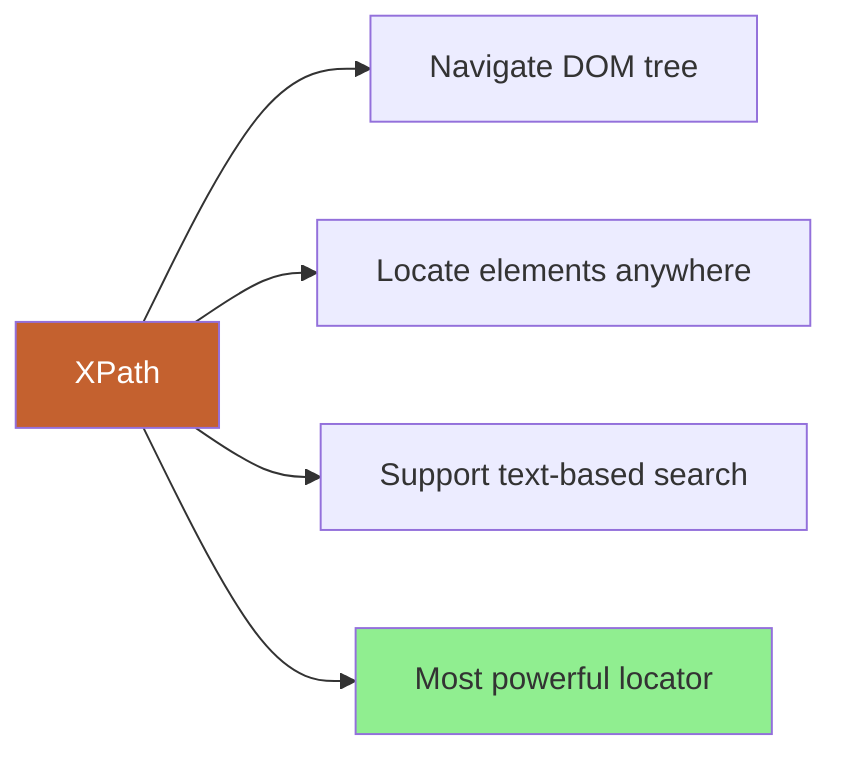
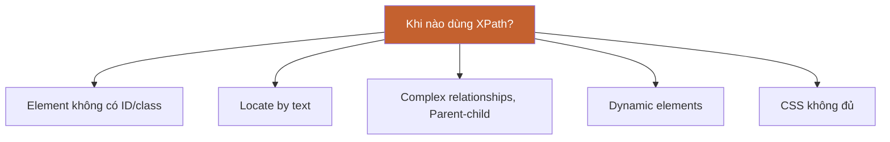
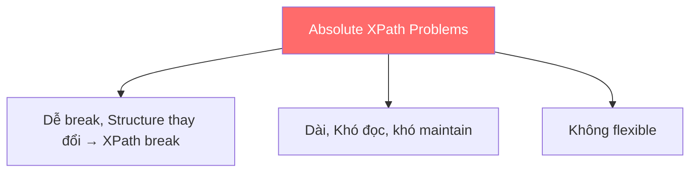
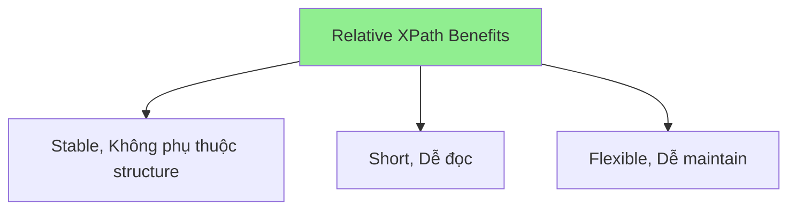
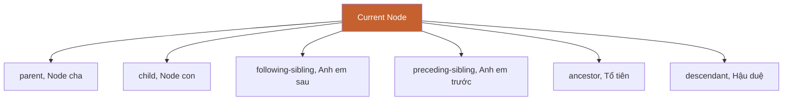
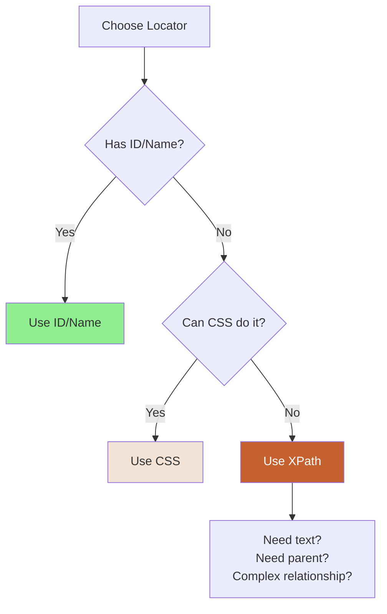

# 🗺️ PHẦN 7: XPATH DEEP DIVE

> **Mục tiêu**: Thành thạo XPath - locator strategy mạnh mẽ nhất, có thể locate bất kỳ element nào trên page.

---

## 📑 MỤC LỤC

1. [XPath là gì?](#xpath-là-gì)
2. [Absolute vs Relative XPath](#absolute-vs-relative-xpath)
3. [Basic XPath Syntax](#basic-xpath-syntax)
4. [XPath Axes](#xpath-axes)
5. [XPath Functions](#xpath-functions)
6. [Dynamic XPath Strategies](#dynamic-xpath-strategies)
7. [XPath vs CSS Selector](#xpath-vs-css-selector)
8. [Real-world Examples](#real-world-examples)

---

## 🎯 XPath là gì?

> **XPath** (XML Path Language) = Ngôn ngữ để navigate và locate elements trong XML/HTML document

### Định nghĩa



**Đơn giản**: XPath = Địa chỉ chi tiết để tìm element trong HTML

---

### Tại sao cần XPath?



---

## 🔀 Absolute vs Relative XPath

### Absolute XPath (❌ BAD)

> **Absolute XPath** = Đường dẫn từ root (html) đến element

**Syntax**: Bắt đầu với `/` (single slash)

```html
<html>
  <body>
    <div>
      <form>
        <input id="email">
      </form>
    </div>
  </body>
</html>
```

```java
// Absolute XPath
driver.findElement(By.xpath("/html/body/div[1]/form/input[1]"));
```

**Vấn đề**:



> ⚠️ **KHÔNG BAO GIỜ dùng Absolute XPath trong automation!**

---

### Relative XPath (✅ GOOD)

> **Relative XPath** = Tìm element từ bất kỳ đâu trong document

**Syntax**: Bắt đầu với `//` (double slash)

```java
// Relative XPath
driver.findElement(By.xpath("//input[@id='email']"));
```

**Ưu điểm**:



---

### So sánh

| Feature | Absolute XPath | Relative XPath |
|---------|----------------|----------------|
| **Syntax** | `/html/body/...` | `//input[@id='email']` |
| **Starts from** | Root (html) | Anywhere |
| **Stability** | ❌ Dễ break | ✅ Stable |
| **Length** | Dài | Ngắn |
| **Readability** | Khó đọc | Dễ đọc |
| **Recommend** | ❌ Never use | ✅ Always use |

---

## 📝 Basic XPath Syntax

### 1. Basic Format

```
//tagname[@attribute='value']
```

**Components**:
- `//` = Tìm từ bất kỳ đâu
- `tagname` = HTML tag (input, button, div...)
- `[@attribute='value']` = Điều kiện

---

### 2. By Tag

```java
// Tất cả input elements
driver.findElements(By.xpath("//input"));

// Tất cả button elements
driver.findElements(By.xpath("//button"));

// Tất cả a elements
driver.findElements(By.xpath("//a"));
```

---

### 3. By Attribute

```html
<input type="text" id="email" name="user_email">
<input type="password" id="password">
<button type="submit">Login</button>
```

```java
// By ID
driver.findElement(By.xpath("//input[@id='email']"));

// By name
driver.findElement(By.xpath("//input[@name='user_email']"));

// By type
driver.findElement(By.xpath("//input[@type='password']"));
driver.findElement(By.xpath("//button[@type='submit']"));
```

---

### 4. Multiple Attributes (AND)

**Syntax**: `and`

```java
// input với type='text' AND name='email'
driver.findElement(By.xpath("//input[@type='text' and @name='user_email']"));

// button với type='submit' AND class='btn-primary'
driver.findElement(By.xpath("//button[@type='submit' and @class='btn-primary']"));
```

---

### 5. Multiple Conditions (OR)

**Syntax**: `or`

```java
// input có id='email' OR id='username'
driver.findElement(By.xpath("//input[@id='email' or @id='username']"));

// button với class='btn' OR class='button'
driver.findElement(By.xpath("//button[@class='btn' or @class='button']"));
```

---

### 6. By Text

**Syntax**: `text()='value'`

```html
<button>Login</button>
<a>Register Now</a>
<span>Welcome, John!</span>
```

```java
// Button với text 'Login'
driver.findElement(By.xpath("//button[text()='Login']"));

// Link với text 'Register Now'
driver.findElement(By.xpath("//a[text()='Register Now']"));

// Span với text 'Welcome, John!'
driver.findElement(By.xpath("//span[text()='Welcome, John!']"));
```

> 💡 **Đây là điểm mạnh của XPath** - CSS không làm được!

---

## 🧭 XPath Axes

> **Axes** = Định nghĩa relationship giữa các nodes trong DOM tree

### Axes Overview



---

### 1. Parent

**Syntax**: `parent::tagname` hoặc `/..`

```html
<div class="form-group">
  <input id="email">
</div>
```

```java
// Parent của input
driver.findElement(By.xpath("//input[@id='email']/parent::div"));

// Shortcut
driver.findElement(By.xpath("//input[@id='email']/.."));
```

**Use case**: Từ child tìm parent

---

### 2. Child

**Syntax**: `child::tagname` hoặc `/tagname`

```html
<div id="loginForm">
  <input id="email">
  <input id="password">
</div>
```

```java
// All children của div
driver.findElements(By.xpath("//div[@id='loginForm']/child::input"));

// Shortcut
driver.findElements(By.xpath("//div[@id='loginForm']/input"));
```

---

### 3. Following-sibling

**Syntax**: `following-sibling::tagname`

```html
<label>Email</label>
<input id="email">
<input id="password">
```

```java
// Input NGAY SAU label
driver.findElement(By.xpath("//label[text()='Email']/following-sibling::input"));

// TẤT CẢ input sau label
driver.findElements(By.xpath("//label[text()='Email']/following-sibling::input"));
```

**Visual**:
```
label
input ← First following-sibling
input ← Second following-sibling
```

---

### 4. Preceding-sibling

**Syntax**: `preceding-sibling::tagname`

```html
<input id="username">
<input id="email">
<label>Email Label</label>
```

```java
// Input TRƯỚC label
driver.findElements(By.xpath("//label[text()='Email Label']/preceding-sibling::input"));
```

---

### 5. Ancestor

**Syntax**: `ancestor::tagname`

```html
<form id="loginForm">
  <div class="form-group">
    <input id="email">
  </div>
</form>
```

```java
// Form ancestor của input
driver.findElement(By.xpath("//input[@id='email']/ancestor::form"));

// Div ancestor
driver.findElement(By.xpath("//input[@id='email']/ancestor::div"));
```

---

### 6. Descendant

**Syntax**: `descendant::tagname` hoặc `//tagname`

```html
<form id="loginForm">
  <div>
    <input id="email">
  </div>
</form>
```

```java
// All input descendants của form
driver.findElements(By.xpath("//form[@id='loginForm']/descendant::input"));

// Shortcut
driver.findElements(By.xpath("//form[@id='loginForm']//input"));
```

---

### Axes Summary Table

| Axis | Meaning | Example |
|------|---------|---------|
| **parent** | Node cha | `//input/parent::div` |
| **child** | Node con trực tiếp | `//div/child::input` |
| **ancestor** | Tất cả node cha (grandparent...) | `//input/ancestor::form` |
| **descendant** | Tất cả node con (grandchild...) | `//form/descendant::input` |
| **following-sibling** | Anh em cùng cấp phía sau | `//label/following-sibling::input` |
| **preceding-sibling** | Anh em cùng cấp phía trước | `//label/preceding-sibling::input` |

---

## 🔧 XPath Functions

### 1. contains()

**Syntax**: `contains(@attribute, 'value')`

```html
<input id="user-email-field-123">
<a href="https://example.com/login-page">Login</a>
<button class="btn btn-primary btn-large">Submit</button>
```

```java
// id contains 'email'
driver.findElement(By.xpath("//input[contains(@id, 'email')]"));

// href contains 'login'
driver.findElement(By.xpath("//a[contains(@href, 'login')]"));

// class contains 'btn-primary'
driver.findElement(By.xpath("//button[contains(@class, 'btn-primary')]"));
```

**Use case**: Dynamic IDs, partial matches

---

### 2. starts-with()

**Syntax**: `starts-with(@attribute, 'value')`

```html
<input id="email-field-123">
<input id="email-field-456">
<div class="btn-primary">Button</div>
```

```java
// id starts with 'email'
driver.findElement(By.xpath("//input[starts-with(@id, 'email')]"));

// class starts with 'btn'
driver.findElement(By.xpath("//div[starts-with(@class, 'btn')]"));
```

---

### 3. text() với contains

**Syntax**: `contains(text(), 'value')`

```html
<button>Click here to Login</button>
<a>Register Now and get started</a>
```

```java
// Text contains 'Login'
driver.findElement(By.xpath("//button[contains(text(), 'Login')]"));

// Text contains 'Register'
driver.findElement(By.xpath("//a[contains(text(), 'Register')]"));
```

**Khác biệt**:
```java
// Exact text
//button[text()='Click here to Login']  // ✅ Match

// Contains text
//button[contains(text(), 'Login')]     // ✅ Match
//button[contains(text(), 'Click')]     // ✅ Match
```

---

### 4. normalize-space()

**Syntax**: `normalize-space()` - Xóa whitespace thừa

```html
<button>   Login   </button>  <!-- Extra spaces -->
<span>
  Welcome
  User
</span>
```

```java
// Xử lý extra spaces
driver.findElement(By.xpath("//button[normalize-space()='Login']"));

// Xử lý line breaks
driver.findElement(By.xpath("//span[contains(normalize-space(), 'Welcome User')]"));
```

---

### 5. position()

**Syntax**: `position()=n` hoặc `[n]`

```html
<ul>
  <li>Item 1</li>
  <li>Item 2</li>
  <li>Item 3</li>
</ul>
```

```java
// First li
driver.findElement(By.xpath("//ul/li[position()=1]"));
driver.findElement(By.xpath("//ul/li[1]")); // Shortcut

// Second li
driver.findElement(By.xpath("//ul/li[2]"));

// Last li
driver.findElement(By.xpath("//ul/li[last()]"));

// Second-to-last
driver.findElement(By.xpath("//ul/li[last()-1]"));
```

---

### 6. count()

**Syntax**: `count(xpath)` - Đếm số elements

```java
// Đếm số input fields
int inputCount = driver.findElements(By.xpath("//input")).size();

// XPath expression
String xpath = "count(//input)"; // Returns number
```

---

## 🔄 Dynamic XPath Strategies

### Problem: Dynamic IDs/Attributes

```html
<!-- ID thay đổi mỗi lần page load -->
<div id="panel-12345">
  <span id="username-12345">testuser</span>
  <button id="edit-btn-12345">Edit</button>
</div>
```

---

### Strategy 1: contains()

```java
// ID contains 'panel'
driver.findElement(By.xpath("//div[contains(@id, 'panel')]"));

// ID contains 'username'
driver.findElement(By.xpath("//span[contains(@id, 'username')]"));

// ID contains 'edit-btn'
driver.findElement(By.xpath("//button[contains(@id, 'edit-btn')]"));
```

---

### Strategy 2: starts-with()

```java
// ID starts with 'panel'
driver.findElement(By.xpath("//div[starts-with(@id, 'panel')]"));

// ID starts with 'username'
driver.findElement(By.xpath("//span[starts-with(@id, 'username')]"));
```

---

### Strategy 3: Combine with other attributes

```java
// Combine ID pattern + type
driver.findElement(By.xpath("//input[contains(@id, 'email') and @type='text']"));

// Combine class + text
driver.findElement(By.xpath("//button[contains(@class, 'btn') and contains(text(), 'Login')]"));
```

---

### Strategy 4: Use stable parent

```html
<form id="userForm">  <!-- Stable ID -->
  <input id="dynamic-123">  <!-- Dynamic -->
</form>
```

```java
// Navigate from stable parent
driver.findElement(By.xpath("//form[@id='userForm']//input"));
```

---

## 🆚 XPath vs CSS Selector

### Comparison Table

| Feature | XPath | CSS Selector |
|---------|-------|--------------|
| **Syntax** | Complex | Simpler |
| **Speed** | Slower | Faster |
| **Text-based search** | ✅ `text()='Login'` | ❌ Cannot |
| **Parent traversal** | ✅ `parent::div` | ❌ Cannot |
| **Axes** | ✅ Many axes | ❌ Limited |
| **Browser native** | ❌ No | ✅ Yes |
| **Learning curve** | Harder | Easier |
| **Power** | Most powerful | Limited |

---

### When to use what?



---

### Examples Side-by-Side

```html
<div id="loginForm">
  <label>Email</label>
  <input type="text" name="email">
  <button class="btn btn-primary">Login</button>
</div>
```

**CSS**:
```java
// By ID
"#loginForm"

// Input inside form
"#loginForm input"

// Button with classes
".btn.btn-primary"

// ❌ Cannot locate by label text
// ❌ Cannot find input's parent
```

**XPath**:
```java
// By ID
"//div[@id='loginForm']"

// Input inside form
"//div[@id='loginForm']//input"

// Button with text
"//button[text()='Login']"

// ✅ By label text + sibling input
"//label[text()='Email']/following-sibling::input"

// ✅ Input's parent
"//input[@name='email']/parent::div"
```

---

## 💼 Real-world Examples

### Example 1: Login Form Complex

```html
<form id="loginForm">
  <div class="form-group">
    <label for="email">Email Address</label>
    <input type="text" id="email" name="user_email">
    <span class="error-msg" style="display:none">Invalid email</span>
  </div>
  <div class="form-group">
    <label for="password">Password</label>
    <input type="password" id="password">
  </div>
  <button type="submit" class="btn btn-primary">Login Now</button>
</form>
```

```java
// Email field - Multiple ways
driver.findElement(By.xpath("//input[@id='email']"));
driver.findElement(By.xpath("//input[@name='user_email']"));
driver.findElement(By.xpath("//label[text()='Email Address']/following-sibling::input"));
driver.findElement(By.xpath("//div[@class='form-group']//input[@type='text']"));

// Error message
driver.findElement(By.xpath("//span[@class='error-msg']"));
driver.findElement(By.xpath("//input[@id='email']/following-sibling::span"));

// Login button by text
driver.findElement(By.xpath("//button[text()='Login Now']"));
driver.findElement(By.xpath("//button[contains(text(), 'Login')]"));
```

---

### Example 2: Table Data

```html
<table id="users">
  <thead>
    <tr>
      <th>Name</th>
      <th>Email</th>
      <th>Actions</th>
    </tr>
  </thead>
  <tbody>
    <tr>
      <td>John Doe</td>
      <td>john@example.com</td>
      <td><button>Edit</button></td>
    </tr>
    <tr>
      <td>Jane Smith</td>
      <td>jane@example.com</td>
      <td><button>Edit</button></td>
    </tr>
  </tbody>
</table>
```

```java
// First data row
driver.findElement(By.xpath("//table[@id='users']//tbody/tr[1]"));

// Second data row
driver.findElement(By.xpath("//table[@id='users']//tbody/tr[2]"));

// Find row by name "John Doe"
driver.findElement(By.xpath("//table[@id='users']//tr[td[text()='John Doe']]"));

// Edit button for John Doe
driver.findElement(By.xpath("//table[@id='users']//tr[td[text()='John Doe']]//button"));

// Get email of Jane Smith
String email = driver.findElement(By.xpath(
    "//table[@id='users']//tr[td[text()='Jane Smith']]/td[2]"
)).getText();

// All emails (2nd column)
List<WebElement> emails = driver.findElements(By.xpath(
    "//table[@id='users']//tbody/tr/td[2]"
));
```

---

### Example 3: Dynamic Dropdown

```html
<div class="dropdown">
  <button class="dropdown-toggle">Select Country</button>
  <ul class="dropdown-menu" style="display:none">
    <li data-value="vn">Vietnam</li>
    <li data-value="us">United States</li>
    <li data-value="uk">United Kingdom</li>
  </ul>
</div>
```

```java
// Click dropdown
driver.findElement(By.xpath("//button[@class='dropdown-toggle']")).click();

// Select "Vietnam"
driver.findElement(By.xpath("//li[text()='Vietnam']")).click();

// Or by data-value
driver.findElement(By.xpath("//li[@data-value='vn']")).click();

// Get selected value
String selected = driver.findElement(By.xpath("//button[@class='dropdown-toggle']")).getText();
```

---

## ✅ TÓM TẮT BÀI HỌC

📌 **XPath** = Most powerful locator strategy  
📌 **Relative XPath** (//...) > Absolute XPath (/...)  
📌 **Basic**: //tag[@attr='value'], text()='value'  
📌 **Axes**: parent, child, following-sibling, ancestor  
📌 **Functions**: contains(), starts-with(), normalize-space()  
📌 **Use XPath when**: CSS không đủ, cần text-based, cần parent traversal  

---

## 🎯 SAU KHI HỌC BUỔI NÀY

### Checklist

- [ ] Hiểu Absolute vs Relative XPath
- [ ] Thành thạo basic XPath syntax
- [ ] Biết dùng XPath axes (parent, sibling...)
- [ ] Biết XPath functions (contains, starts-with...)
- [ ] Biết khi nào dùng XPath vs CSS

### 📝 Thực hành

**Bài 1: Basic XPath**

```html
<form id="loginForm">
  <input type="text" id="email" name="user_email">
  <input type="password" id="password">
  <button type="submit">Login</button>
</form>
```

Viết XPath:
```java
// 1. Input by ID
// 2. Input by name
// 3. Button by type
// 4. Button by text
```

**Bài 2: XPath Axes**

```html
<div class="form-group">
  <label>Email</label>
  <input id="email">
</div>
```

Viết XPath:
```java
// 1. Input by label text (following-sibling)
// 2. Label by input ID (preceding-sibling)
// 3. Div parent của input
```

**Bài 3: Dynamic XPath**

```html
<div id="user-panel-12345">
  <span id="username-12345">testuser</span>
</div>
```

Viết XPath với contains/starts-with:
```java
// 1. Div với dynamic ID
// 2. Span với dynamic ID
```

---

[← Bài trước: CSS Selector](06-css-selector-deep-dive.md) | [Bài tiếp: WebElement Actions →](08-webelement-actions.md)

---

**Happy XPathing!** 🗺️  
*"XPath: When CSS says 'I can't', XPath says 'I got this'."*
