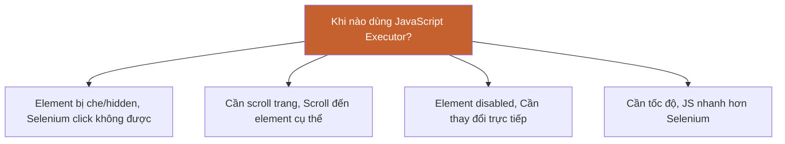

# 🔧 PHẦN 13: JAVASCRIPT EXECUTOR

> **Mục tiêu**: Sử dụng JavaScript để thực hiện các thao tác mà Selenium WebDriver không thể làm hoặc làm khó.

---

## 📑 MỤC LỤC

1. [JavaScript Executor là gì?](#javascript-executor-là-gì)
2. [Khi nào dùng JavaScript Executor?](#khi-nào-dùng)
3. [Execute Script](#execute-script)
4. [Scroll Operations](#scroll-operations)
5. [Click Hidden Elements](#click-hidden-elements)
6. [Get/Set Values](#getset-values)
7. [Modify Attributes](#modify-attributes)

---

## 🎯 JavaScript Executor là gì?

> **JavascriptExecutor** = Interface cho phép execute JavaScript code trong browser thông qua Selenium

### Casting Driver

```java
// Cast WebDriver thành JavascriptExecutor
JavascriptExecutor js = (JavascriptExecutor) driver;
```

---

## 🤔 Khi nào dùng?



**Các tình huống thường gặp**:
- ✅ Scroll trang hoặc scroll đến element
- ✅ Click element bị hidden/covered
- ✅ Get/Set giá trị trực tiếp
- ✅ Thay đổi attributes (readonly, disabled...)
- ✅ Highlight element để debug

---

## 💻 Execute Script

### executeScript() - Execute và return value

```java
JavascriptExecutor js = (JavascriptExecutor) driver;

// Execute simple script
js.executeScript("alert('Hello from Selenium!');");

// Execute với return value
String title = (String) js.executeScript("return document.title;");
System.out.println("Page title: " + title);

// Execute với arguments
WebElement button = driver.findElement(By.id("submit"));
js.executeScript("arguments[0].click();", button);
```

### executeAsyncScript() - Execute async script

```java
// Dùng cho async operations
js.executeAsyncScript(
    "var callback = arguments[arguments.length - 1];" +
    "setTimeout(function() { callback('Done'); }, 3000);"
);
```

---

## 📜 Scroll Operations

### 1. Scroll xuống cuối trang

```java
JavascriptExecutor js = (JavascriptExecutor) driver;

// Scroll to bottom
js.executeScript("window.scrollTo(0, document.body.scrollHeight);");
```

---

### 2. Scroll lên đầu trang

```java
// Scroll to top
js.executeScript("window.scrollTo(0, 0);");
```

---

### 3. Scroll một khoảng cụ thể

```java
// Scroll down 500 pixels
js.executeScript("window.scrollBy(0, 500);");

// Scroll up 300 pixels
js.executeScript("window.scrollBy(0, -300);");
```

---

### 4. Scroll đến element cụ thể

```java
WebElement element = driver.findElement(By.id("footer"));

// Scroll into view
JavascriptExecutor js = (JavascriptExecutor) driver;
js.executeScript("arguments[0].scrollIntoView(true);", element);

// Scroll với smooth behavior
js.executeScript("arguments[0].scrollIntoView({behavior: 'smooth', block: 'center'});", element);
```

---

### Complete Scroll Example

```java
@Test
public void testScrollOperations() {
    driver.get("https://example.com");
    JavascriptExecutor js = (JavascriptExecutor) driver;
    
    // Scroll down slowly
    for (int i = 0; i < 5; i++) {
        js.executeScript("window.scrollBy(0, 300);");
        Thread.sleep(500);
    }
    
    // Scroll to footer
    WebElement footer = driver.findElement(By.id("footer"));
    js.executeScript("arguments[0].scrollIntoView(true);", footer);
    
    // Scroll back to top
    js.executeScript("window.scrollTo(0, 0);");
}
```

---

## 🖱️ Click Hidden Elements

### Problem: Element bị che hoặc hidden

```java
WebElement hiddenButton = driver.findElement(By.id("hiddenBtn"));

// ❌ Selenium click sẽ fail
// hiddenButton.click(); // ElementNotInteractableException

// ✅ JavaScript click sẽ work
JavascriptExecutor js = (JavascriptExecutor) driver;
js.executeScript("arguments[0].click();", hiddenButton);
```

---

### Click element overlay

```html
<!-- Button bị div overlay che -->
<div class="overlay" style="position:absolute; z-index:1000"></div>
<button id="submit">Submit</button>
```

```java
WebElement submitBtn = driver.findElement(By.id("submit"));

// Selenium click không được vì bị che
// submitBtn.click(); // ElementClickInterceptedException

// JavaScript click bypass overlay
JavascriptExecutor js = (JavascriptExecutor) driver;
js.executeScript("arguments[0].click();", submitBtn);
```

---

## 📝 Get/Set Values

### Get values

```java
JavascriptExecutor js = (JavascriptExecutor) driver;

// Get page title
String title = (String) js.executeScript("return document.title;");

// Get URL
String url = (String) js.executeScript("return document.URL;");

// Get domain
String domain = (String) js.executeScript("return document.domain;");

// Get input value
WebElement input = driver.findElement(By.id("email"));
String value = (String) js.executeScript("return arguments[0].value;", input);

// Get inner text
String text = (String) js.executeScript("return arguments[0].innerText;", input);
```

---

### Set values

```java
JavascriptExecutor js = (JavascriptExecutor) driver;
WebElement input = driver.findElement(By.id("email"));

// Set value trực tiếp (nhanh hơn sendKeys)
js.executeScript("arguments[0].value='test@example.com';", input);

// Set multiple fields
js.executeScript(
    "document.getElementById('email').value='test@example.com';" +
    "document.getElementById('password').value='Test@123';"
);
```

---

## 🔧 Modify Attributes

### Remove attributes

```java
JavascriptExecutor js = (JavascriptExecutor) driver;
WebElement input = driver.findElement(By.id("readonly-field"));

// Remove readonly attribute
js.executeScript("arguments[0].removeAttribute('readonly');", input);

// Giờ có thể type vào field
input.sendKeys("New value");

// Remove disabled
WebElement button = driver.findElement(By.id("disabled-btn"));
js.executeScript("arguments[0].removeAttribute('disabled');", button);
```

---

### Set/Change attributes

```java
JavascriptExecutor js = (JavascriptExecutor) driver;
WebElement element = driver.findElement(By.id("target"));

// Set attribute
js.executeScript("arguments[0].setAttribute('class', 'active');", element);

// Change value
js.executeScript("arguments[0].setAttribute('value', 'new value');", element);

// Set multiple attributes
js.executeScript(
    "arguments[0].setAttribute('class', 'highlight');" +
    "arguments[0].setAttribute('style', 'border: 2px solid red;');",
    element
);
```

---

### Get attribute value

```java
// Get attribute
String className = (String) js.executeScript(
    "return arguments[0].getAttribute('class');", 
    element
);

// Get style
String style = (String) js.executeScript(
    "return arguments[0].style.backgroundColor;",
    element
);
```

---

## 🎨 Highlight Element (for debugging)

```java
public void highlightElement(WebElement element) {
    JavascriptExecutor js = (JavascriptExecutor) driver;
    
    // Save original style
    String originalStyle = element.getAttribute("style");
    
    // Highlight với border đỏ
    js.executeScript(
        "arguments[0].setAttribute('style', 'border: 3px solid red;');",
        element
    );
    
    // Wait 2 seconds
    try {
        Thread.sleep(2000);
    } catch (InterruptedException e) {
        e.printStackTrace();
    }
    
    // Restore original style
    js.executeScript(
        "arguments[0].setAttribute('style', '" + originalStyle + "');",
        element
    );
}

// Usage
WebElement button = driver.findElement(By.id("submit"));
highlightElement(button); // Highlight rồi click
button.click();
```

---

## 🚀 Performance Tips

### Batch operations

```java
// ❌ Chậm - Multiple calls
js.executeScript("document.getElementById('name').value='John';");
js.executeScript("document.getElementById('email').value='john@example.com';");
js.executeScript("document.getElementById('phone').value='1234567890';");

// ✅ Nhanh - Single call
js.executeScript(
    "document.getElementById('name').value='John';" +
    "document.getElementById('email').value='john@example.com';" +
    "document.getElementById('phone').value='1234567890';"
);
```

---

## 💼 Real-world Examples

### Example 1: Handle Date Picker

```java
@Test
public void testDatePicker() {
    driver.get("https://example.com/booking");
    
    // Date picker thường khó handle bằng Selenium
    // → Dùng JS set value trực tiếp
    JavascriptExecutor js = (JavascriptExecutor) driver;
    WebElement dateField = driver.findElement(By.id("checkin-date"));
    
    js.executeScript("arguments[0].value='2024-12-25';", dateField);
    
    // Verify
    String value = dateField.getAttribute("value");
    Assert.assertEquals(value, "2024-12-25");
}
```

---

### Example 2: Infinite Scroll Page

```java
@Test
public void testInfiniteScroll() {
    driver.get("https://example.com/products");
    JavascriptExecutor js = (JavascriptExecutor) driver;
    
    // Get initial product count
    List<WebElement> products = driver.findElements(By.className("product"));
    int initialCount = products.size();
    
    // Scroll to bottom để load more
    js.executeScript("window.scrollTo(0, document.body.scrollHeight);");
    
    // Wait for new products to load
    Thread.sleep(2000);
    
    // Verify more products loaded
    products = driver.findElements(By.className("product"));
    Assert.assertTrue(products.size() > initialCount);
}
```

---

### Example 3: Generate Events

```java
// Trigger change event
JavascriptExecutor js = (JavascriptExecutor) driver;
WebElement dropdown = driver.findElement(By.id("country"));

js.executeScript(
    "arguments[0].value='Vietnam';" +
    "arguments[0].dispatchEvent(new Event('change'));",
    dropdown
);
```

---

## ✅ TÓM TẮT BÀI HỌC

📌 **JavascriptExecutor** = Execute JavaScript trong browser  
📌 **Use cases**: Scroll, click hidden, get/set values, modify attributes  
📌 **Scroll**: scrollTo(), scrollBy(), scrollIntoView()  
📌 **Click**: arguments[0].click() - bypass overlay/hidden  
📌 **Attributes**: setAttribute(), removeAttribute(), getAttribute()  
📌 **Performance**: Batch multiple operations trong 1 call  

---

## 🎯 SAU KHI HỌC BUỔI NÀY

### Checklist

- [ ] Hiểu khi nào cần dùng JavaScript Executor
- [ ] Biết scroll trang và scroll đến element
- [ ] Biết click hidden elements
- [ ] Biết get/set values trực tiếp
- [ ] Biết modify attributes

### 📝 Thực hành

**Bài 1: Scroll Operations**

```java
// 1. Scroll xuống cuối trang
// 2. Scroll đến footer element
// 3. Scroll back to top
```

**Bài 2: Click Hidden Element**

Tạo page với button bị hidden:
```html
<button id="hiddenBtn" style="display:none">Click me</button>
```

```java
// Click button bằng JavaScript
```

**Bài 3: Modify Readonly Field**

```html
<input id="readonly" value="Cannot edit" readonly>
```

```java
// 1. Remove readonly attribute
// 2. Set new value
// 3. Verify value changed
```

---

[← Bài trước: Actions Class](12-actions-class.md) | [Bài tiếp: Screenshots & Logs →](14-screenshots-logs.md)

---

**Happy Scripting!** 🔧  
*"When Selenium says 'I can't', JavaScript says 'Watch this!'"*
