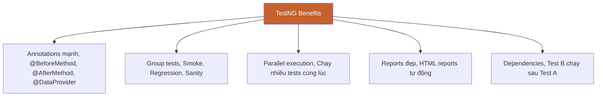

# 🧪 PHẦN 15: TESTNG BASICS

> **Mục tiêu**: Hiểu TestNG framework - công cụ mạnh mẽ để organize và run tests trong Selenium.

## 📑 MỤC LỤC

1. [TestNG là gì?](#testng-là-gì)
2. [TestNG Annotations](#testng-annotations)
3. [Test Lifecycle](#test-lifecycle)
4. [testng.xml](#testngxml)
5. [Assertions](#assertions)

## 🎯 TestNG là gì?

> **TestNG** (Test Next Generation) = Testing framework cho Java, thay thế JUnit

### Tại sao dùng TestNG?



## 📝 TestNG Annotations

### Annotation Hierarchy

```java
@BeforeSuite
  @BeforeTest
    @BeforeClass
      @BeforeMethod
        @Test
      @AfterMethod
    @AfterClass
  @AfterTest
@AfterSuite
```

### Common Annotations

```java
import org.testng.annotations.*;

public class TestNGDemo {
    
    @BeforeSuite
    public void beforeSuite() {
        System.out.println("Before Suite - Chạy 1 lần đầu tiên");
    }
    
    @BeforeTest
    public void beforeTest() {
        System.out.println("Before Test - Trước mỗi <test> tag");
    }
    
    @BeforeClass
    public void beforeClass() {
        System.out.println("Before Class - Setup cho class này");
        // Launch browser
        driver = new ChromeDriver();
    }
    
    @BeforeMethod
    public void beforeMethod() {
        System.out.println("Before Method - Trước mỗi @Test");
        // Navigate to homepage
        driver.get("https://example.com");
    }
    
    @Test
    public void test1() {
        System.out.println("Test 1 đang chạy");
    }
    
    @Test
    public void test2() {
        System.out.println("Test 2 đang chạy");
    }
    
    @AfterMethod
    public void afterMethod() {
        System.out.println("After Method - Sau mỗi @Test");
        // Clear cookies
    }
    
    @AfterClass
    public void afterClass() {
        System.out.println("After Class - Cleanup cho class");
        // Close browser
        driver.quit();
    }
    
    @AfterTest
    public void afterTest() {
        System.out.println("After Test - Sau mỗi <test> tag");
    }
    
    @AfterSuite
    public void afterSuite() {
        System.out.println("After Suite - Chạy cuối cùng");
    }
}
```

## 🔄 Test Lifecycle

### Execution Order

```
1. @BeforeSuite
2. @BeforeTest
3. @BeforeClass
4. @BeforeMethod
5. @Test (test1)
6. @AfterMethod
7. @BeforeMethod
8. @Test (test2)
9. @AfterMethod
10. @AfterClass
11. @AfterTest
12. @AfterSuite
```

## 📄 testng.xml

### Basic testng.xml

```xml
<?xml version="1.0" encoding="UTF-8"?>
<!DOCTYPE suite SYSTEM "https://testng.org/testng-1.0.dtd">
<suite name="Test Suite">
    <test name="Login Tests">
        <classes>
            <class name="com.example.tests.LoginTest"/>
            <class name="com.example.tests.DashboardTest"/>
        </classes>
    </test>
</suite>
```

### Multiple Tests

```xml
<suite name="Regression Suite">
    <test name="Smoke Tests">
        <classes>
            <class name="com.example.tests.LoginTest"/>
        </classes>
    </test>
    
    <test name="Functional Tests">
        <classes>
            <class name="com.example.tests.ProductTest"/>
            <class name="com.example.tests.CheckoutTest"/>
        </classes>
    </test>
</suite>
```

### Run Specific Methods

```xml
<suite name="Test Suite">
    <test name="Login Tests">
        <classes>
            <class name="com.example.tests.LoginTest">
                <methods>
                    <include name="testValidLogin"/>
                    <include name="testInvalidLogin"/>
                </methods>
            </class>
        </classes>
    </test>
</suite>
```

## ✅ Assertions

### Common Assertions

```java
import org.testng.Assert;

// Equals
Assert.assertEquals(actual, expected);
Assert.assertEquals(actual, expected, "Error message");

// True/False
Assert.assertTrue(condition);
Assert.assertTrue(condition, "Error message");
Assert.assertFalse(condition);

// Null/NotNull
Assert.assertNull(object);
Assert.assertNotNull(object);

// Fail test
Assert.fail("Test failed!");
```

### Soft Assertions

```java
import org.testng.asserts.SoftAssert;

SoftAssert softAssert = new SoftAssert();

// Multiple assertions - không stop ngay khi fail
softAssert.assertEquals(actual1, expected1, "Check 1");
softAssert.assertEquals(actual2, expected2, "Check 2");
softAssert.assertTrue(condition, "Check 3");

// Collect tất cả failures
softAssert.assertAll();
```

## ✅ TÓM TẮT

📌 **TestNG** = Framework mạnh mẽ hơn JUnit  
📌 **Annotations**: @BeforeMethod, @AfterMethod, @Test  
📌 **testng.xml**: Configure tests, suite, parallel  
📌 **Assertions**: assertEquals, assertTrue, assertFalse

[← Bài trước: Screenshots](14-screenshots-logs.md) | [Bài tiếp: TestNG Annotations →](16-testng-annotations.md)
